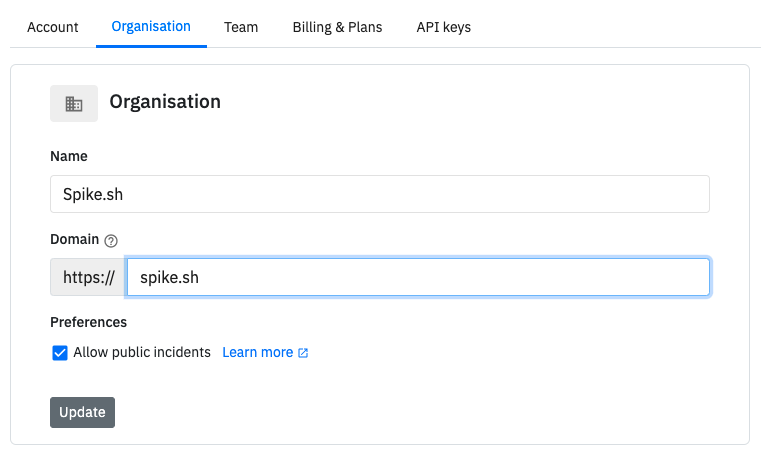

# Adding team members

Adding team members on Spike is very easy. Click on the **Add team **link on the header to invite your team.

Anyone on Spike.sh can add a team member. Your organisation will also have a **unique invite link** which can be shared with your other teammates to join you.

### Security with unique link

Signups with your unique link is absolutely safe. For added security, we recommend only allowing signups with emails of your work domain. You can edit the domain in **settings > organisation**

