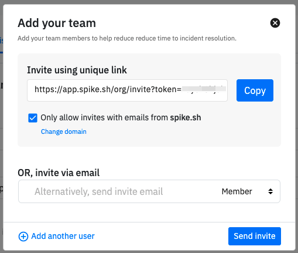
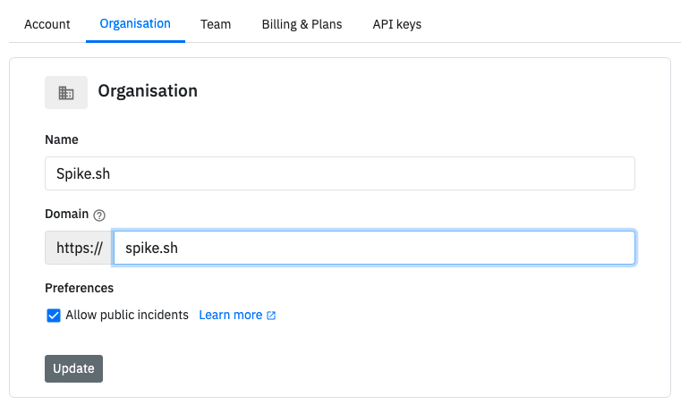

# Adding team members

Click **Add team** in the top navigation to send an invite. Any team member can invite others.

Spike also generates a unique invite link for your organisation. Share it with teammates to let them join directly.

<figure><figcaption></figcaption></figure>

## Restrict signups by domain

Signups via the unique invite link are open to anyone with the link. To restrict access, configure an approved email domain in [Settings > Organisation](https://app.spike.sh/settings/general/organisation). Only members with that domain can then join.

<figure><figcaption></figcaption></figure>