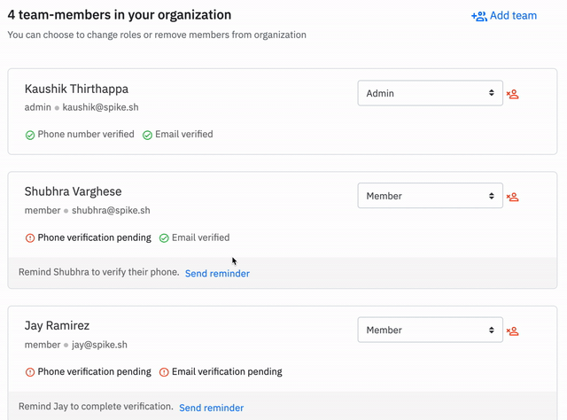

# Check if team is getting alerts

It is paramount that your team members have verified their account's phone number and email. As a member or an admin, you can check individual status for each of your team mates status on verification. You can then choose to send a reminder to them as well.


Note that a team member who has not verified their email and/or phone will not receive alerts on those channels from us


