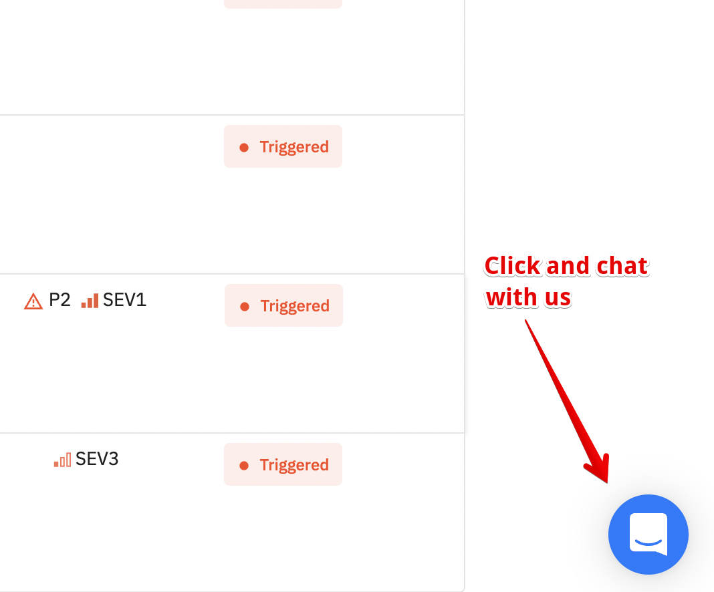

# Contact the support team

Spike's support team is available via chat, email, or a scheduled call.

<figure><figcaption></figcaption></figure>

- **Chat:** Use the chat widget in the bottom-right corner of the screen.
- **Email:** Reach the support team at [support@spike.sh](mailto:support@spike.sh).
- **Call:** Schedule a call directly on [Calendly](https://calendly.com/spikehq).