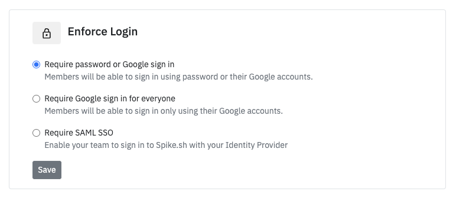

# Enforce login

For security, as an admin, you can enforce all members to login via Google or SAML SSO (needs pre-configuration). To set up, visit [Settings > Organisation](https://app.spike.sh/settings/general/organisation)

If enabled for Google, users will be asked to connect their Google accounts. For SSO SAML, users will be restricted from accessing the page unless logging in from your identitiy provider. 


Based on your preferences, we will automatically adjust the invite sign up page to show only the available option for joining your organisation's account on Spike.sh.
