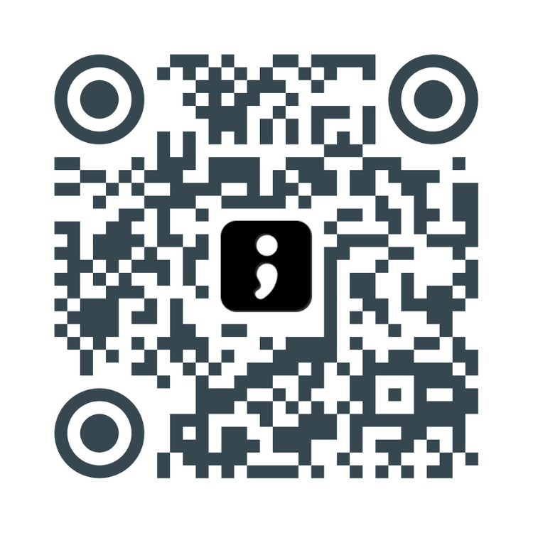

# Notification numbers

## Bypass Do Not Disturb

Download Spike's contact card and add it to your contacts. To bypass Do Not Disturb on your phone, add Spike to your favorites.

Works with:

- iOS
- Android
- All email clients
- macOS
- Windows


Download Spike's contact card and save the number to your favorites.


Or scan the QR code below to add Spike as a contact:

<figure><figcaption></figcaption></figure>

Check the [supported countries and regions](https://app.spike.sh/geo-permissions) for phone calls and SMS.