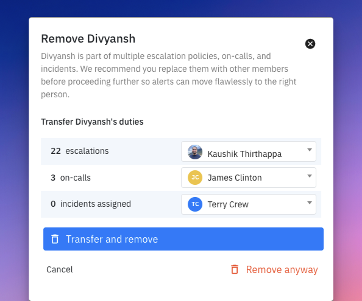
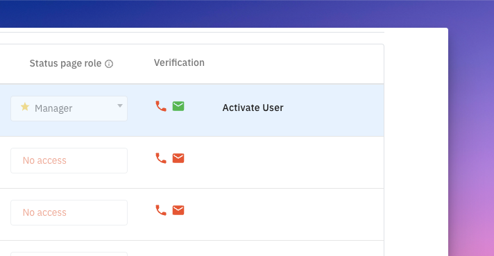

# Removing team members

Only admins can remove a team member. In [team settings](https://app.spike.sh/settings/general/team), click the remove icon next to the member. Spike shows the number of escalation policies they're part of and any open incidents assigned to them. Once removed, the member stops receiving alerts.

## Transfer duties before removing

Before removing a member, transfer their responsibilities in on-call schedules, escalation policies, and any incidents they're responding to. This ensures a smooth transition and prevents the removed member from inadvertently going on-call again.

<figure><figcaption></figcaption></figure>

## Effect on escalation policies

When a member is removed, Spike automatically excludes them from all escalation policies they were part of. For example, if a policy alerts User A first and User B after 20 minutes, removing User A means the policy skips directly to User B without delay.


If the escalation policy only included this member, that policy will no longer trigger. Transfer their duties or update the escalation policy before removing them.


## Effect on open incidents

Open incidents assigned to the removed member remain unassigned. Add another responder or transfer those responsibilities during the removal process.


Billing is adjusted in the next month's cycle, based on the highest number of team members in your organisation during that period.


## Can I add the same member back?

Yes. But you'll need to re-add them to the relevant escalation policies and reassign any incidents they were handling. [Find removed members here](https://app.spike.sh/settings/general/team/invites-and-deactivated).

<figure><figcaption></figcaption></figure>