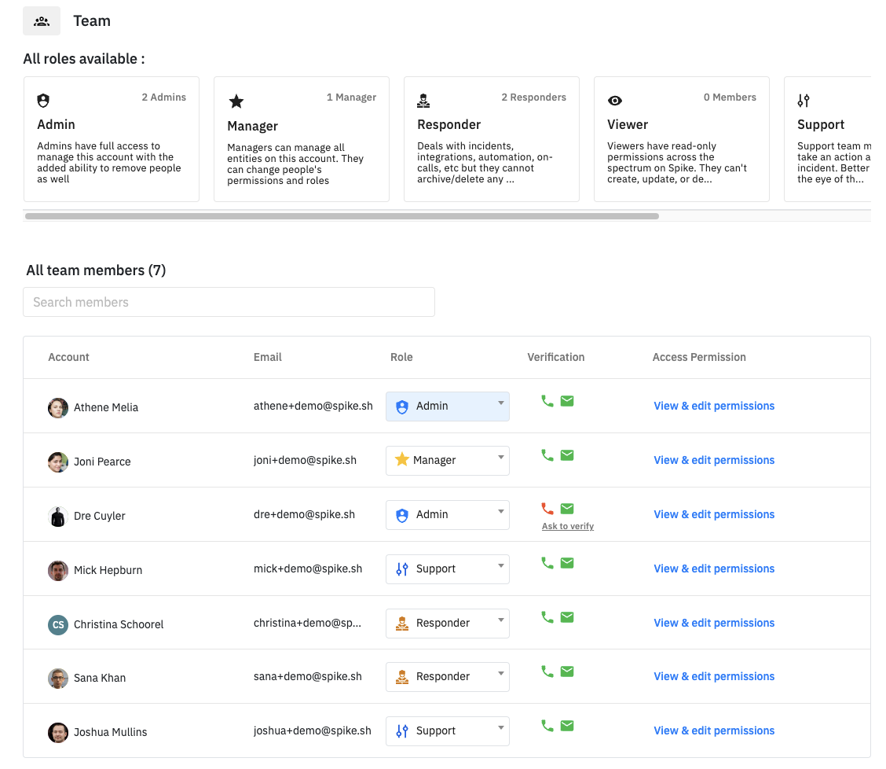
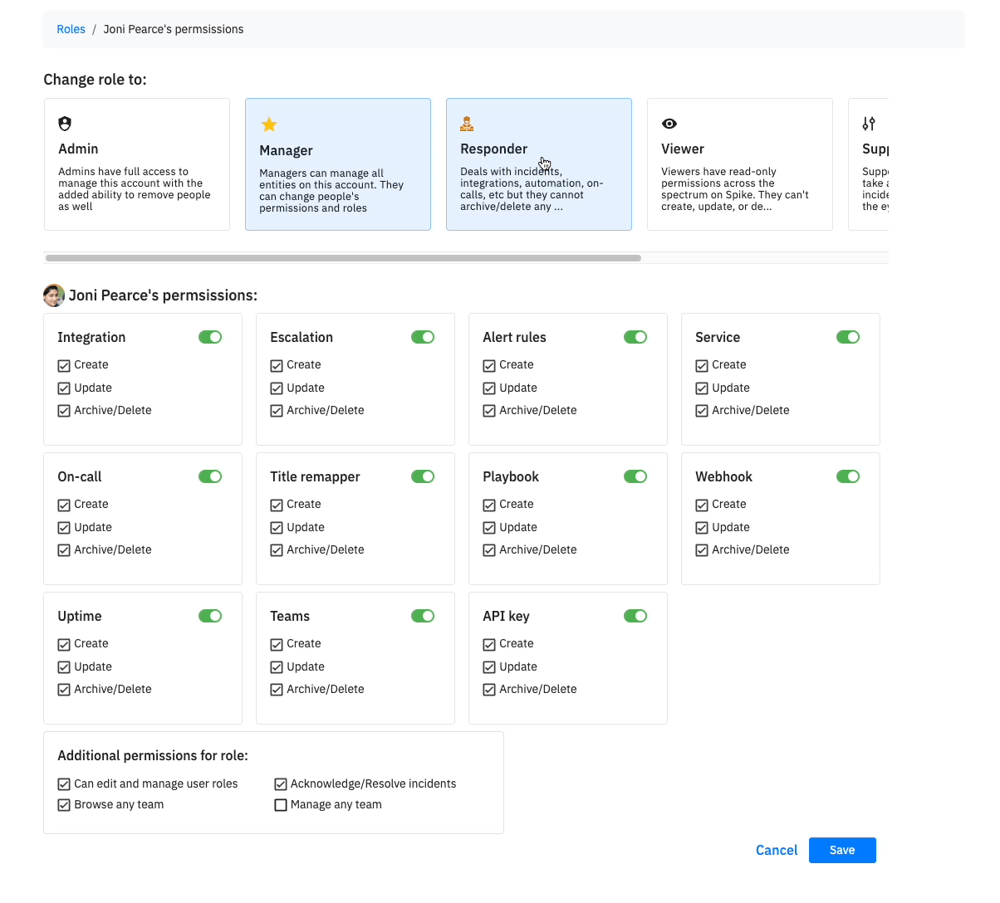
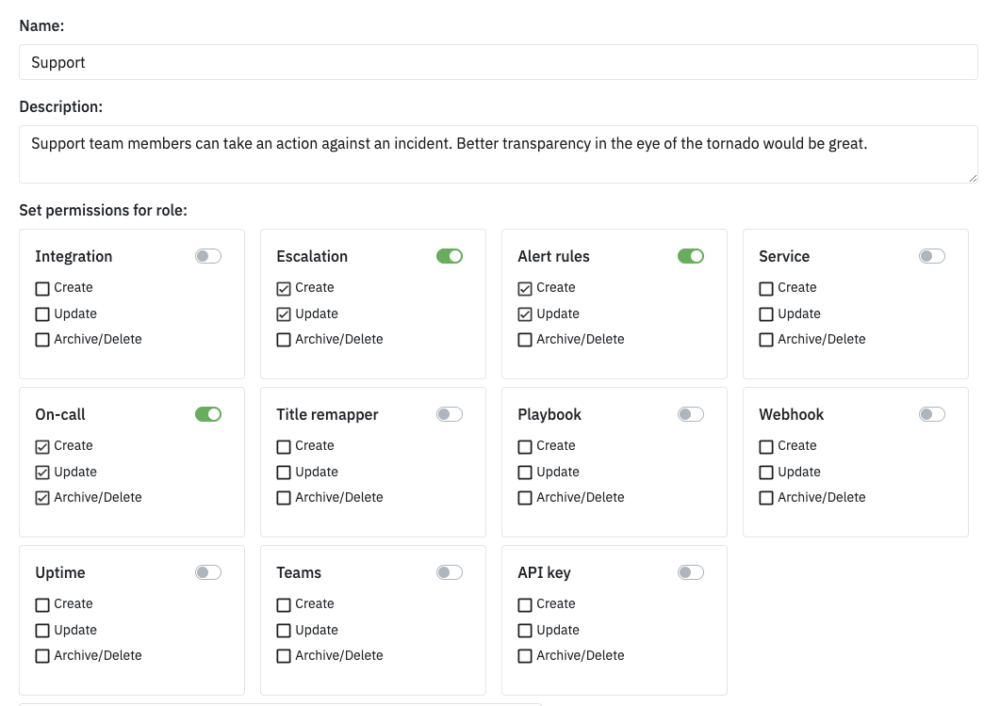

# Roles and access

## Roles

Checkour roles and access under [Organisation > Team](https://app.spike.sh/settings/general/team). Every member in your team will be assigned a role and every role will have a pre-defined set of permissions that admins can edit.

By default, these are the different roles available:

| Role      | Desc                                                                                                    |
| --------- | ------------------------------------------------------------------------------------------------------- |
| Admin     | Admins have full access to manage this account with the added ability to remove people as well          |
| Manager   | Managers can manage all entities on this account. They can change people's permissions and roles        |
| Responder | Deals with incidents, integrations, automation, on-calls, etc but they cannot archive/delete any entity |
| Viewer    | Viewers have read-only permissions across the spectrum on Spike. They can't create, update, or delete   |

Click on the roles above to see who has a given role.

## Access control

Access control mainly revolves around who can create, edit, delete or archive integrations, incidents, on-call schedules and so on.

You can click on `View & edit permissions` to see and alter each member's permission.

## FAQs

### How to edit control for a user?

Click on `View & edit permissions` for a user and then change the role for what seems fit.

### I don't see a role fit a user, what should I do?

Best to create a new role. Yes, that's possible. On the teams page, click on Create role. In this section, create a new role with whatever permissions you would like to give and then assign the user the newly created role.


Status page roles and access works similarly but without the responder role.


### How do I remove a user?

Click on the remove icon next to the user's info in the table to remove a user. However, make sure that you replace them from escalation policies and on-call schedules too.
