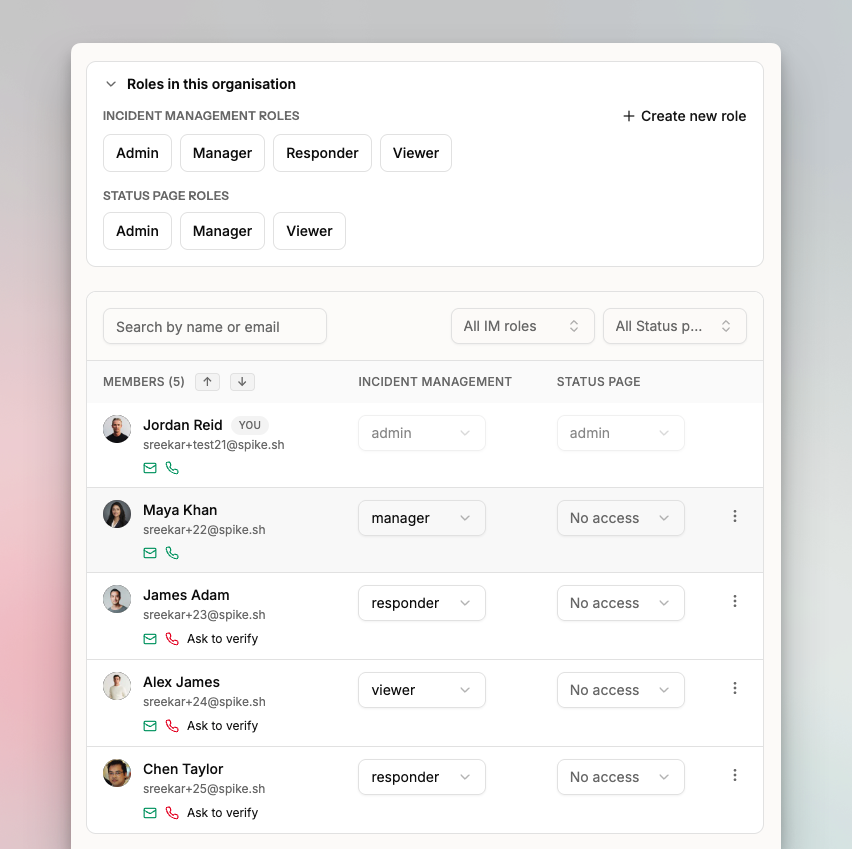
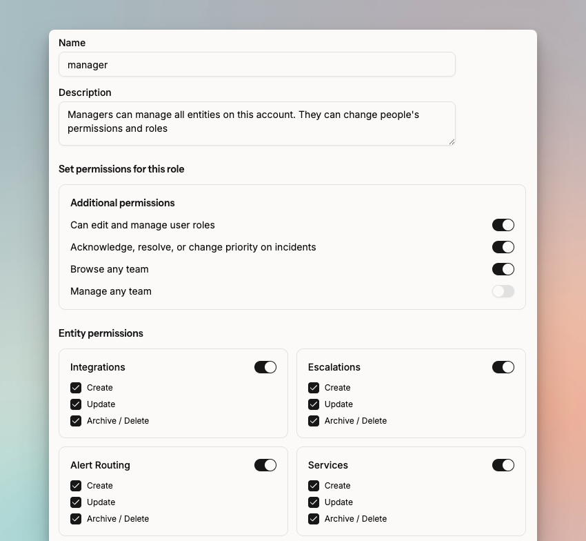
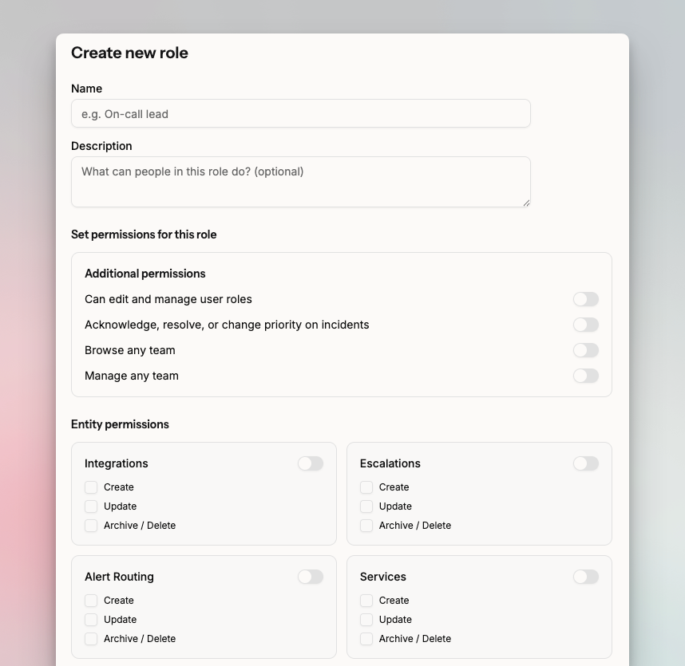

# Roles and access

Every team member is assigned a role. Each role comes with a predefined set of permissions that admins can edit. Manage roles and access under [Organisation > Team](https://app.spike.sh/settings/general/team).

## Roles

By default, four roles are available:

| Role      | Description                                                                                             |
| --------- | ------------------------------------------------------------------------------------------------------- |
| Admin     | Full access to manage the account, including the ability to remove members                              |
| Manager   | Can manage all entities on the account and change members' permissions and roles                        |
| Responder | Can work with incidents, integrations, automation, and on-calls, but cannot archive or delete entities  |
| Viewer    | Read-only access across Spike. Cannot create, update, or delete anything                                |

<figure><figcaption></figcaption></figure>

Click a role to see the members assigned to it.

## Access control

Access control defines what each team member can do in Spike.

Click **View & edit permissions** on any member to see and change their permissions.

<figure><figcaption></figcaption></figure>

## FAQs

### What if no existing role fits a user?

Create a custom role. On the Team page, click **Create role**, configure the permissions you need, and assign the new role to the user.

<figure><figcaption></figcaption></figure>


Status pages have their own access settings. The same roles apply, except the Responder role is not available there.


### How do I remove a user?

Click the remove icon next to the user in the table. Make sure to also replace them in any escalation policies and on-call schedules.
