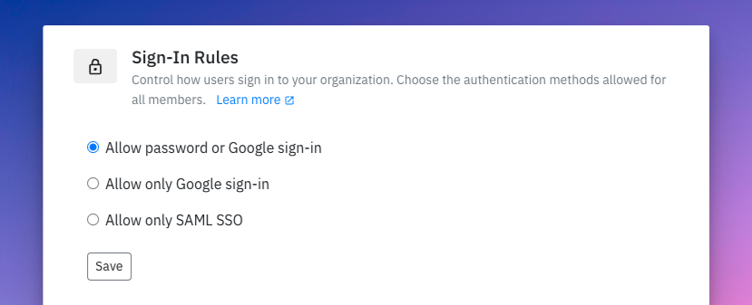

# Sign-In Rules  

As an admin, you can enforce secure sign-in methods for all members by requiring authentication via **Google** or **SAML SSO** (requires pre-configuration).  

To configure, visit [Settings > Organisation](https://app.spike.sh/settings/general/organisation).  

  

## Enforce Google or SAML SSO  

When enabled:  
- **Google Sign-In:** Users must connect their Google accounts to log in.  
- **SAML SSO:** Users must authenticate through your identity provider. Access will be restricted otherwise.  


Based on your settings, the invite sign-up page will automatically adjust to display only the allowed sign-in method.  
  

## Restrict Email Domains  

Admins can further control access by restricting sign-ins to specific email domains. Once configured, only users with the approved domain(s) can join and log in to Spike.  
