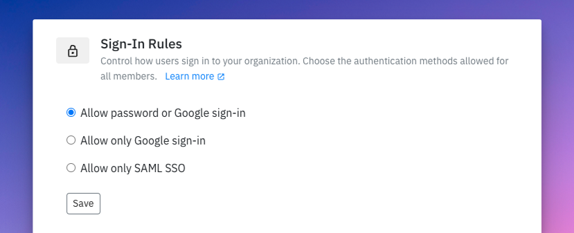

# Sign-in rules

As an admin, you can enforce authentication via **Google** or **SAML SSO** for all members. SAML SSO requires pre-configuration before it can be enforced.

To configure, visit [Settings > Organisation](https://app.spike.sh/settings/general/organisation).

<figure><figcaption></figcaption></figure>

## Enforce Google or SAML SSO

When enabled:

- **Google Sign-In:** Members must connect their Google accounts to log in.
- **SAML SSO:** Members must authenticate through your identity provider.


The invite sign-up page automatically shows only the allowed sign-in method.


## Restrict email domains

Restrict sign-ins to specific email domains. Once configured, only members with an approved domain can join and log in to Spike.
