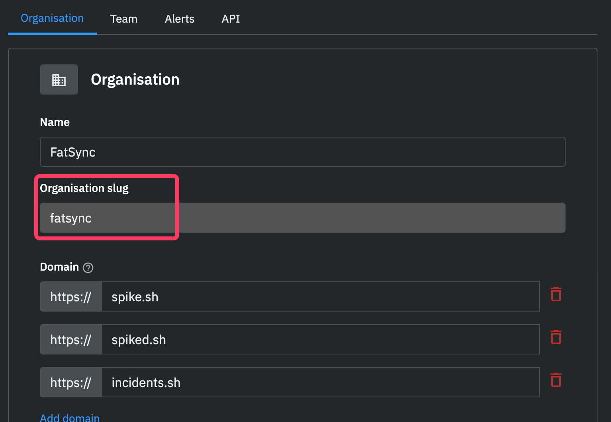

# SSO

This guide explains the settings you’d need to use to configure SAML with your Identity Provider. Once this is set up you should get an XML metadata file which you can provide to Spike.sh and start using SSO. 

Guides for setting up SAML with other IdPs

1. [How to setup SAML on Microsoft Azure AD](https://docs.microsoft.com/en-us/power-apps/maker/portals/configure/configure-saml2-settings-azure-ad)
2. [How to setup SAML on Google Workspace](https://support.google.com/a/answer/6087519?hl=en)
3. [How to setup SAML on Onelogin](https://www.onelogin.com/blog/saml-configuration)
4. [How to setup SAML on Centrify](https://docs.centrify.com/Content/Applications/AppsCustom/AddConfigSAML.htm)

### Step 1

Follow the configurations given below while configuring your SAML with your IdP. You can configure SAML SSO for Incident Management and Status Page products individually.


The below values will be the same for Okta, Microsoft Azure AD, Google, and other IdPs.


#### For our Incident management dashboard
* Assertion consumer service URL / Single Sign-On URL / Destination URL: `https://app.spike.sh/sso/oauth/saml`
* Entity ID / Identifier / Audience URI / Audience Restriction: `https://app.spike.sh`
* Response: `Signed`
* Assertion Signature: `Signed`
* Signature Algorithm: `RSA-SHA256`
* Assertion Encryption: `Unencrypted`

#### For our Status page dashboard
* Assertion consumer service URL / Single Sign-On URL / Destination URL: `https://statuspage.spike.sh/sso/status-page/oauth/saml`
* Entity ID / Identifier / Audience URI / Audience Restriction: `https://statuspage.spike.sh`
* Response: `Signed`
* Assertion Signature: `Signed`
* Signature Algorithm: `RSA-SHA256`
* Assertion Encryption: `Unencrypted`

For example, in the case of Okta users, this is how the configuration looks

 (2).png>)

### Step 2

Add user mappings as shown below. Note that `email` , `firstName` and `lastName` are mandatory.

.png>)

### Step 3

Once the SAML is configured, head over to Spike.sh and open [organisation settings.](https://app.spike.sh/settings/general/organisation)

Paste the IdP XML Metadata and save.

### Step 4

Once configured, you can find the organisation slug from [organisation settings.](https://app.spike.sh/settings/general/organisation)

.png>)

Use that slug at the time of login.&#x20;

