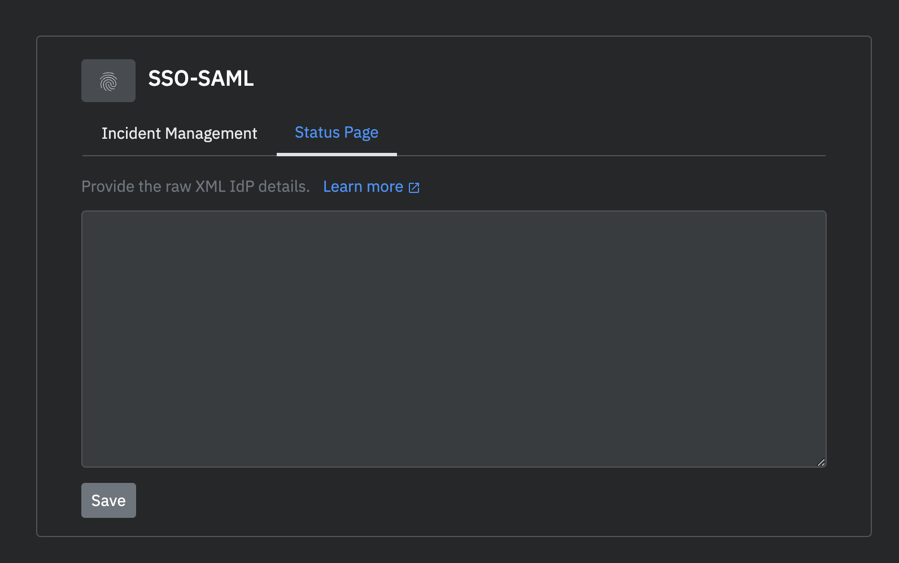
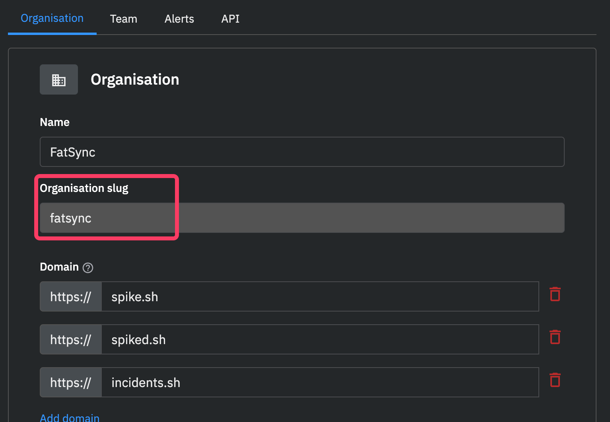

# Single Sign-On (SSO)

Spike supports SAML SSO for the incident management dashboard and the status page dashboard. Configure SAML with your Identity Provider (IdP), then paste the XML metadata into Spike to activate SSO.

## Set up SAML with your IdP

Guides for common identity providers:

1. [Set up SAML on Microsoft Azure AD](https://docs.microsoft.com/en-us/power-apps/maker/portals/configure/configure-saml2-settings-azure-ad)
2. [Set up SAML on Google Workspace](https://support.google.com/a/answer/6087519?hl=en)
3. [Set up SAML on OneLogin](https://www.onelogin.com/blog/saml-configuration)
4. [Set up SAML on Centrify](https://docs.centrify.com/Content/Applications/AppsCustom/AddConfigSAML.htm)

## Step 1: Configure SAML in your IdP

Use the values below when configuring SAML. These values apply to Okta, Microsoft Azure AD, Google, and other providers.

### Incident management dashboard

- **Assertion consumer service URL / Single Sign-On URL / Destination URL:** `https://app.spike.sh/sso/oauth/saml`
- **Entity ID / Identifier / Audience URI / Audience Restriction:** `https://app.spike.sh`
- **Response:** `Signed`
- **Assertion Signature:** `Signed`
- **Signature Algorithm:** `RSA-SHA256`
- **Assertion Encryption:** `Unencrypted`

### Status page dashboard

- **Assertion consumer service URL / Single Sign-On URL / Destination URL:** `https://statuspage.spike.sh/sso/status-page/oauth/saml`
- **Entity ID / Identifier / Audience URI / Audience Restriction:** `https://statuspage.spike.sh`
- **Response:** `Signed`
- **Assertion Signature:** `Signed`
- **Signature Algorithm:** `RSA-SHA256`
- **Assertion Encryption:** `Unencrypted`

<figure><figcaption>
Example SAML configuration in Okta.
</figcaption></figure>

## Step 2: Add user attribute mappings

Add the user attribute mappings as shown below. `email`, `firstName`, and `lastName` are required.

<figure><figcaption></figcaption></figure>

## Step 3: Paste the XML metadata in Spike

Open [organisation settings](https://app.spike.sh/settings/general/organisation), paste the IdP XML metadata, and save.

<figure><figcaption></figcaption></figure>

## Step 4: Sign in using your organisation slug

Find your organisation slug in [organisation settings](https://app.spike.sh/settings/general/organisation) and use it at the login screen to sign in via SSO.

<figure><figcaption></figcaption></figure>

<figure><figcaption></figcaption></figure>
