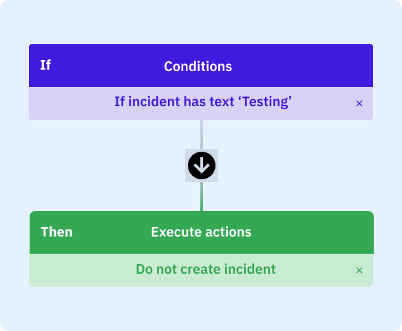
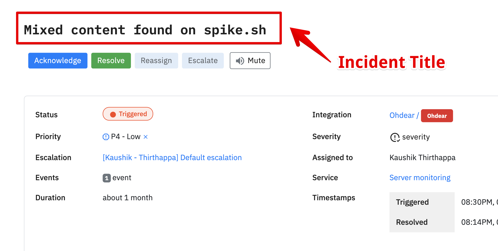

# Alert routing rules

Alert routing rules evaluate conditions on every incoming incident and execute actions when those conditions are met. You can chain multiple conditions with AND/OR logic and apply multiple rulesets to a single incident.

<figure><figcaption>
An example alert routing rule with conditions and actions.
</figcaption></figure>

## Conditions

Each condition evaluates to true or false. If any condition block evaluates to true, Spike executes the configured actions.

### Apply to all incidents

Evaluates to true for every incident. Use this when an action should run unconditionally.

### Incident title

Evaluates to true if the incident title contains, does not contain, equals, or does not equal a specific text or phrase.

<figure><figcaption>
Incident title condition.
</figcaption></figure>

### Incident details

Evaluates to true if a specific key in the incident details contains, does not contain, equals, or does not equal a specific value. Enter a key or nested key to compare against.

### Incident has repeated

Evaluates to true if the total number of incident occurrences crosses a threshold you set.

### Incident has repeated within

Evaluates to true if incident occurrences cross a threshold within a given timeframe.

### Incident suppressed

Evaluates to true if the incident has been suppressed at least a minimum number of times.

### Incident suppressed within

Evaluates to true if the incident has been suppressed at least a minimum number of times within a given timeframe.

### Priority

Evaluates to true if the incident has a given priority. [Learn more about priority](https://docs.spike.sh/incidents/priority-and-severity#priority)

### Severity

Evaluates to true if the incident has a given severity. [Learn more about severity](https://docs.spike.sh/incidents/priority-and-severity#severity)

### Time of day

Evaluates to true if the incident triggers between timestamps you set, in any timezone.

### Days of week

Evaluates to true if the incident triggers on specific days of the week.

## Actions

Set one or more actions to execute when conditions are met.

### Reassign incident to

Assigns the incident to a team member. An email notification is sent to the assignee.

### Load escalation policy

Replaces the default escalation policy with one you specify. Useful for routing high-severity incidents to a more comprehensive policy.

### Change integration

Changes the incident's integration.

This helps you set up a single webhook URL across multiple integrations, use conditions like incident title, and change the integration automatically.

### Ignore incident

Prevents the incident from being created. No alerts are sent and the incident doesn't appear on the dashboard.

### Mark priority as

Sets the incident's priority. [Learn more about priority](https://docs.spike.sh/incidents/priority-and-severity#priority)

### Mark severity as

Sets the incident's severity. [Learn more about severity](https://docs.spike.sh/incidents/priority-and-severity#severity)

### Trigger outbound webhook

Sends a webhook to a URL you specify when the conditions are met.

### Acknowledge incident

Creates the incident in the acknowledged state. No alerts are sent, but the incident appears as open on the dashboard.

### Resolve incident

Creates the incident in the resolved state. No alerts are sent and the incident doesn't appear as open on the dashboard.

### Resolve by Timer

Automatically resolves the incident after a set duration. [Learn more about Resolve by Timer](resolve-timer.md)

## Route to other team

Enable the **Route to other team** toggle in the Actions section to send an incident from one team to another. Select the source team, destination team, and destination integration.

## Applying multiple rulesets

Multiple alert routing rulesets can apply to a single incident. For example:

<figure><figcaption>
Ruleset 1: mark as P5 if title contains "syslog".
</figcaption></figure>

<figure><figcaption>
Ruleset 2: change escalation policy if title contains "syslog".
</figcaption></figure>

If an incident title contains "syslog", both rulesets apply: the incident is marked P5 and the escalation policy changes to Slack dev.


No more than 5 alert routing rulesets apply to a single incident.

