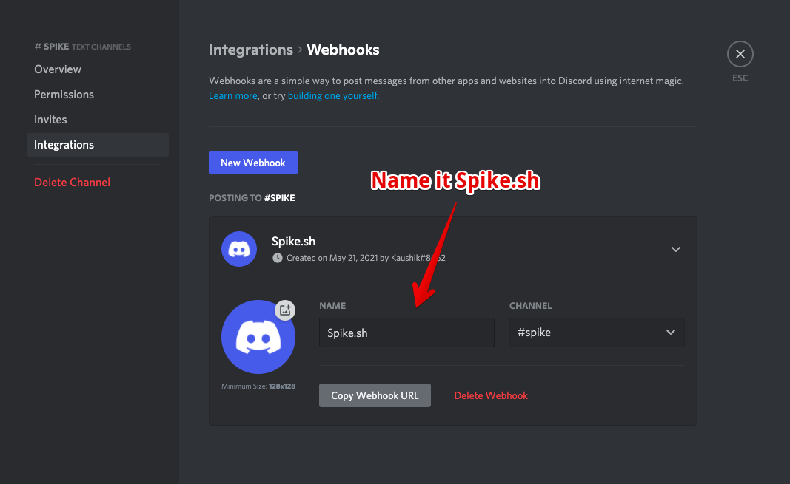
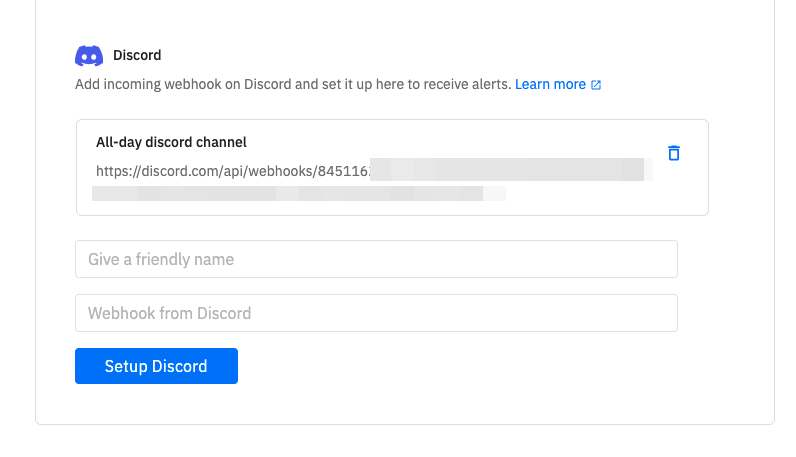

# Discord

## Get Discord notifications from Spike.sh

Our Discord alert channel is incredibly simple yet informative. Once you add Discord alert channel, you will get a neat hello from us. On every new incident, you will get Incident details along with the link to navigate and take action. 

## How to setup?

With Discord, you can get alerts on your Discord workspace using the channel webhooks, by setting up and adding Discord to your escalation policy.

**Step 1**

Navigate to any channel's **settings** &gt; **integrations.** Select the webhook integration on the integrations page.

**Step 2**

Name the integration Spike.sh and copy the webhook URL. Download the below badge to use it as the avatar. 



**Step 3**

On Spike dashboard, navigate to **settings &gt;** **organisation.** Paste the copied webhook URL in the Discord setup and save.


Once saved, we will send an example message to your new Discord alert channel


**Step 4**

You should be able to find Discord option enabled in your escalation policy like so -

\*\*\*\*

### Deleting Discord alert channel

You can always delete this channel on Spike.sh but you must ensure that it's not part of any escalation policy.


Our Discord bot currently does not accept inputs for you to acknowledge or resolve an incident.


