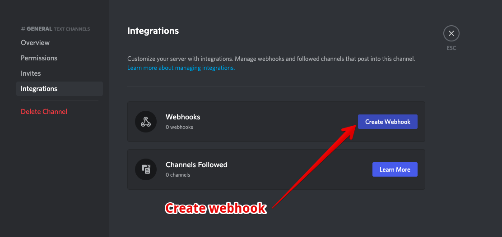
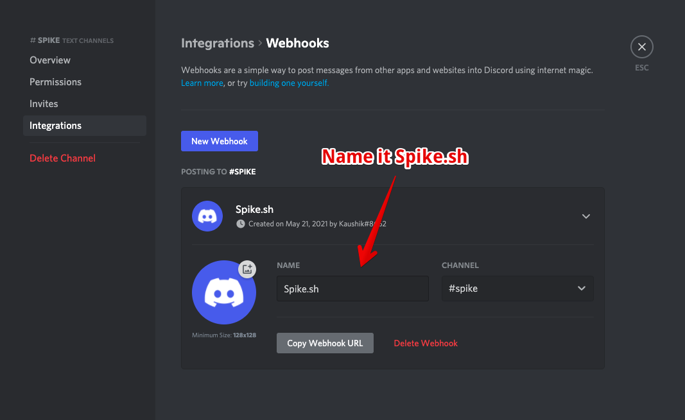
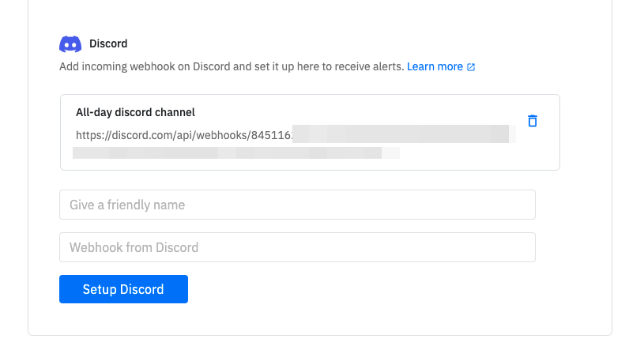

# Discord

<figure><figcaption>
Incident alert on Discord.
</figcaption></figure>

## How to set up



### Create a webhook in Discord

Navigate to your channel's **Settings** > **Integrations** and select **Webhooks**.

<figure><figcaption>
Webhook settings in a Discord channel.
</figcaption></figure>


### Name and copy the webhook URL

Name the webhook **Spike** and copy the URL. You can use the badge below as the avatar.


Spike badge for Discord


<figure><figcaption>
Name the webhook and copy the URL.
</figcaption></figure>


### Paste the URL in Spike

Go to [Settings > Organisation > Alerts](https://app.spike.sh/settings/general/alerts), paste the webhook URL in the Discord setup, and save.

<figure><figcaption>
Paste the webhook URL in Spike settings.
</figcaption></figure>


Once saved, Spike sends a test message to your Discord channel.



### Add Discord to your escalation policy

Select Discord as a step in your [escalation policy](https://app.spike.sh/escalations).

<figure><figcaption>
Discord as a step in an escalation policy.
</figcaption></figure>



## Remove a Discord channel

You can remove a Discord channel from Spike, but make sure it's not part of any active escalation policy before doing so.


Discord doesn't support acknowledging or resolving incidents from the channel. Use the Spike dashboard, phone, SMS, or other alert channels to take action.

