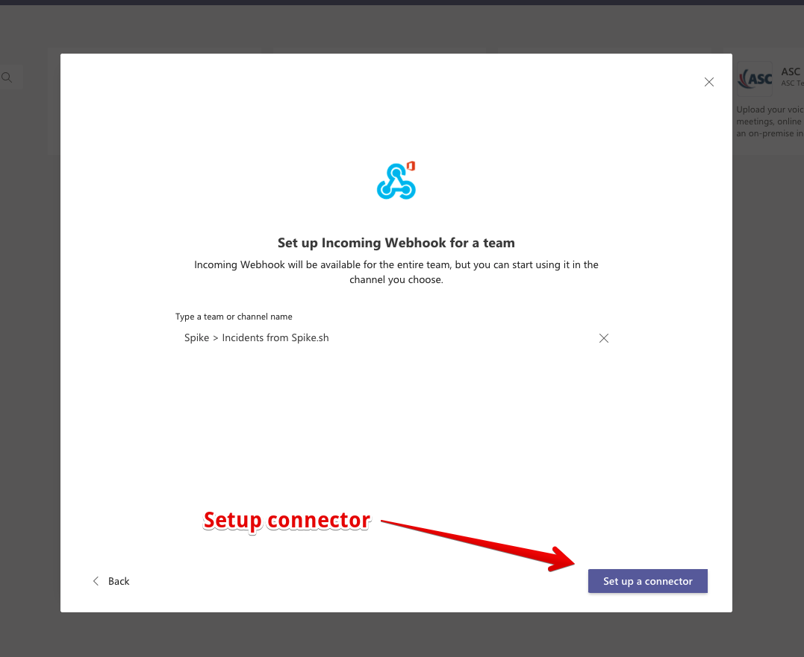
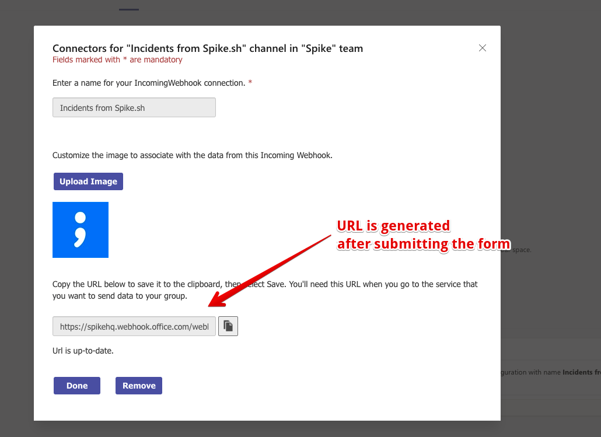

# Microsoft Teams

## Microsoft Teams

Our app on Microsoft Teams make it incredibly easy to get alerts and instantly take actions against them. Quick list of available actions:

1. Get incident alerts on Teams channels
2. Create a new incident from Teams
3. Acknowledge, Resolve, Escalate, Set priority and severity, and trigger an Outbound webhook
4. Get DMs for On-call shift start/end, invites to war-room, and when you are mentioned in a comment on Spike.sh
5. Know who is on-call and learn more about your current and upcoming on-call shift timings

Download our app from [this link](https://teams.microsoft.com/l/app/aea2c271-cfd3-4360-86bb-4a16998b2bde?source=app-details-dialog) or find Spike.sh in Teams Apps on the sidebar. Please ping your admins in case you need permissions to install an app on Teams. In case you are unable to install it, please use the **Incoming Webhook** methodology to get alerts. _scroll down to find instructions on setup_



### Getting started with the App

Once installed, you will receive a message from our app with instructions to connect your account. We recommend connecting your Spike.sh account to Teams using the `connect` **and** `connect-org` commands.


The `connect` command connects your account on Spike.sh with Teams enabling DMs for on-call shift start/end and when you are mentioned in a comment. Whereas, the `connect-org` command connects your organisation's account on Spike.sh with Teams enabling you to get actionable alerts on incidents.

We recommend you run both commands and follow the link.


Here is a list of available commands

1. `create-new-incident` - Create a new incident from Teams
2. `oncall-me` - Info on whether you are on-call and when does the shift end?
3. `oncall-now` - Who is on-call right now?
4. `disconnect` - Disconnects your Spike.sh account with Teams. _This will disconnect only your account. Incident alerts will still be available in channels._

### Setting up incident alerts with the App

Once connected, you should be able to add any of your available Teams channels in an escalation policy. Select Teams and your channels will be listed automatically on the right hand side.

Anyone on Teams can take actions against an incident. We recommend you create a different channel among responders to receive alerts. If an incident is acknowledged or resolved from the dashboard, phone call, email, or any other medium then it will be automatically reflected along with suppressed count and repeated counts.

### DMs

Once the `connect` command is run, you can use the `oncall-me` and `oncall-now` to get info on oncall schedules. You will also get alerts from Spike.sh for invites to War rooms, mentions to comments, and you will also be able to create a new incident directly from Teams.

## Get Teams alerts from Spike.sh using Incoming Webhook

The alert messages on Microsoft Teams (referred to as Teams from here on) comes with gists for you and your team to quickly learn about the incident.

.png>)

### How to set up Teams?

**Step 1 - Setup incoming webhook**

Go to the Apps section in your teams account and install the **Incoming Webhook** app (created by Microsoft).

Select a channel of your choice and click **setup connector**

Name your connector and upload our Spike.sh logo so as to easily identify alerts coming from us. [You can download our logo here.](https://drive.google.com/drive/u/1/folders/1o1JwoMXVY9uYUb8v12wZOMUhaaxVLHnH)

**Step 2 - Paste the URL on Spike.sh**

Head over to Spike.sh dashboard and visit [settings > organisation > alerts](https://app.spike.sh/settings/general/alerts) and create a Teams integration by giving a friendly name along with the URL you copied from step 1.


Make sure to paste the exact URL from above. Any changes in the URL might result in missing alerts


.png>)


Once integrated, we will send a sample alert to your configured Teams channel


A friendly name will help you identify this integration while creating escalation policies. Like below -

.png>)

You can create multiple Teams integrations with different incoming webhooks configured on Teams.


Our MS Team alert channel accepts inputs from you to acknowledge or resolve an incident.


#### Possible Caveats

We have noticed that in some MS Teams account, **acknowledge** and the **resolve** buttons fail.

.png>)

It could be possible because the connector is disabled in your tenant setting access list. Another possible cause for this could be that you are using a legacy account.

Refer to this [GitHub issue](https://github.com/MicrosoftDocs/msteams-docs/issues/1221) or why this might happen.
