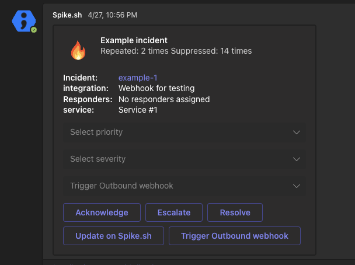

# Microsoft Teams

Our Microsoft Teams app simplifies incident management by delivering alerts directly to your Teams channels and enabling you to take immediate actions. Below is a quick overview of the available features:

1. **Receive Incident Alerts**: Get real-time incident alerts directly in your Teams channels
2. **Create Incidents from Teams**: Seamlessly create new incidents directly from within Microsoft Teams and keep your workflow uninterrupted.
3. **Manage Incidents**: Easily acknowledge, resolve, or escalate incidents.
4. **On-call Notifications**: Receive direct messages for the start and end of your on-call shifts, invitations to join a war-room, and notifications when you're mentioned in a comment on Spike.sh.
5. **On-Call Shift Information**: Quickly check who is currently on-call and get details about your current and upcoming on-call shift timings.

[Install our Teams app](https://teams.microsoft.com/l/app/aea2c271-cfd3-4360-86bb-4a16998b2bde?source=app-details-dialog) directly or search for "Spike.sh" in the Teams Apps section on the sidebar. If you need assistance with installation due to permission restrictions, please contact your Teams admin.



### Getting Started with the Spike App on Microsoft Teams

After installing the app, you'll receive a message with instructions on how to connect your Spike account. For full functionality, we recommend using both the `connect` **and** `connect-org` commands.


- The `connect` command links your personal Spike account with Teams, enabling direct messages for on-call shift notifications and when you are mentioned in a comment.

- The `connect-org` command links your organization’s Spike account with Teams. This will enable your org to receive actionable incident alerts in channels.

For the best experience, we suggest running both commands.


### Available Commands



* **New incident**:
  * `/create-new-incident` - Create a new incident from Teams
* **Am I on-call?**:
  * `/oncall-me` - Check if you are on-call and when your shift ends.
* **Who is on-call?**:
  * `/oncall-now` - See who is currently on-call.
* **Disconnect**:
  * `/disconnect` - Disconnects your Spike account from Teams. _Note: This will only disconnect your personal account. Incident alerts will continue to be available in channels._



### Setting Up Incident Alerts with the Spike App

Once your account is connected, you can easily add any of your Teams channels to an escalation policy. To do this, select "Teams" in the escalation policy, and your available channels will automatically appear on the right-hand side.

Any team member can take action on an incident directly from Teams. We recommend creating a dedicated channel for responders to receive and manage alerts. If an incident is acknowledged or resolved via the Spike dashboard, phone call, email, or any other medium, the latest incident will be automatically reflected in the Teams channel, along with the suppressed and repeated counts.

### Direct Messages (DMs)

After running the connect command, you can use the `oncall-me` and `oncall-now` commands to get information about your on-call schedules directly in Teams. You will also receive direct messages from Spike.sh for important notifications, such as:

1. Invites to War rooms
2. Mentions in comments
3. The ability to create new incidents directly from Teams
4. Your on-call shift alerts

## Connecting multiple groups on Teams
The Spike bot allows you to connect to multiple groups of channels in Microsoft Teams. This makes it easy for organizations with several teams to receive alerts and manage incidents directly from Teams.

### How to connect?
1. In Microsoft Teams, go to the channel of the desired group you want to connect.
2. Type `@Spike.sh connect-org` to connect with Spike.

There is no limit on how many groups can be connected. 

### After connecting:
- Visit your [Escalation Policies] on Spike and add your desired channel to receive alerts.
- You’ll see the newly connected Teams channels listed in the dropdown menu.

***

## Deprecated - Get Teams alerts from Spike using Incoming Webhook


Microsoft has deprecated all new webhook connectors on 15th September and Spike has officially deprecated the incoming webhook support on 26th November 2024.


The alert messages on Microsoft Teams (referred to as Teams from here on) comes with gists for you and your team to quickly learn about the incident.

.png>)

