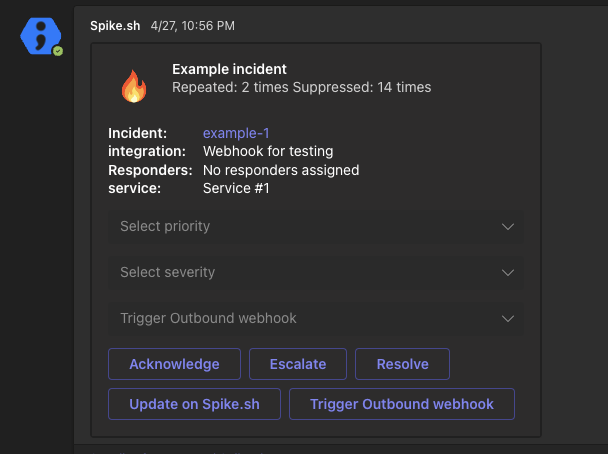
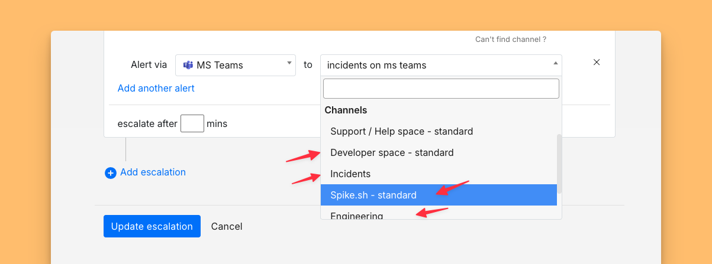

# Microsoft Teams

The Spike app for Microsoft Teams delivers incident alerts to your channels and on-call notifications to your DMs.

Key features:

- Real-time incident alerts in Teams channels
- Acknowledge, resolve, or escalate incidents from Teams
- Create incidents directly from Teams
- On-call shift notifications via DMs
- Check who is currently on-call

[Install the Teams app](https://teams.microsoft.com/l/app/aea2c271-cfd3-4360-86bb-4a16998b2bde?source=app-details-dialog) directly or search for "Spike" in the Teams Apps section. Contact your Teams admin if you need help with installation due to permission restrictions.



## Getting started

After installing the app, you'll receive a message with instructions on how to connect your Spike account. Run both the `connect` and `connect-org` commands for full functionality.


- The `connect` command links your personal Spike account with Teams, enabling direct messages for on-call shift notifications and comment mentions.
- The `connect-org` command links your organisation's Spike account with Teams, enabling incident alerts in channels.

Run both commands for the best experience.


## Available commands



* **New incident** (`/create-new-incident`): Create a new incident from Teams.
* **Am I on-call?** (`/oncall-me`): Check if you are on-call and when your shift ends.
* **Who is on-call?** (`/oncall-now`): See who is currently on-call.
* **Disconnect** (`/disconnect`): Disconnects your personal Spike account from Teams. Incident alerts in channels continue.



## Setting up incident alerts

Once connected, add any Teams channel to an escalation policy. Select **Teams** in the escalation policy and your available channels appear on the right.

<figure><figcaption>
Incident alerts in a Teams channel.
</figcaption></figure>

Any team member can take action on an incident directly from Teams. Creating a dedicated channel for responders is a good practice.

If an incident is acknowledged or resolved via the Spike dashboard, phone, email, or any other channel, the Teams message updates automatically with the latest status, including suppressed and repeat counts.

## Direct messages

<figure><figcaption>
Direct messages from Spike in Teams.
</figcaption></figure>

After running the `connect` command, Spike sends direct messages for:

1. War room invites
2. Comment mentions
3. On-call shift alerts

Use `/oncall-me` and `/oncall-now` to check on-call schedules directly in Teams.

## Connecting multiple groups

The Spike bot connects to multiple groups of channels in Teams. This is useful for organisations with several teams.

### How to connect

1. In Teams, go to the channel of the group you want to connect.
2. Type `@Spike.sh connect-org` to connect with Spike.

There is no limit on how many groups can be connected.

### After connecting

- Visit your [Escalation Policies](https://app.spike.sh/escalations) and add the desired channel to receive alerts.
- The newly connected Teams channels appear in the dropdown.

### Finding channels in escalations

Teams shows the group name only alongside the first channel from each group. The first channel appears as "standard" instead of the actual channel name. Other channels from the same group don't show the group name. This can cause confusion if you have similarly named channels across different groups.

<figure><figcaption>
How Teams channel names appear in escalation policies.
</figcaption></figure>

For example:

- **Spike.sh - standard**: the first channel in the "Spike.sh" group, even if the channel's actual name is different
- **Engineering**: another channel in the same group, shown without the group name
- **Developer space - standard**: the first channel in "Developer space"; actual name is "dev space"
- **Incidents**: another channel in the same group, shown without the group name

## Deprecated: incoming webhook


Microsoft deprecated all new webhook connectors on 15th September 2024. Spike deprecated incoming webhook support on 26th November 2024.


<figure><figcaption>
Incident alert via the deprecated incoming webhook method.
</figcaption></figure>
