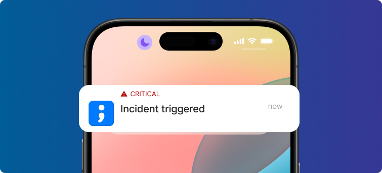

# Mobile app alerts

<figure><figcaption>
Spike mobile app alerts.
</figcaption></figure>

Spike's mobile app sends real-time incident alerts to your phone. Download the app, log in, and allow notifications to start receiving alerts.



<figure><figcaption></figcaption></figure>

[Download the iOS app](https://apps.apple.com/au/app/spike-sh/id1586777789) from the App Store.


<figure><figcaption></figcaption></figure>

[Download the Android app](https://play.google.com/store/apps/details?id=sh.spike.spike\_sh\_app) from the Play Store.



## Setup

To receive mobile alerts, add phone notifications to your escalation policies. Spike will then deliver alerts directly to your device.

## Critical alerts

Critical alerts reach you even when your device is on Do Not Disturb.

### iOS

Spike supports Apple's critical notifications. Configure this in the app settings to apply to critical incidents only, or all incidents.


Critical notifications make sound even when your iPhone is on mute.


### Android

Spike supports Android's critical notifications. Configure this in the app settings to apply to critical incidents only, or all incidents.


Critical notifications make sound even when your Android device is on mute.

