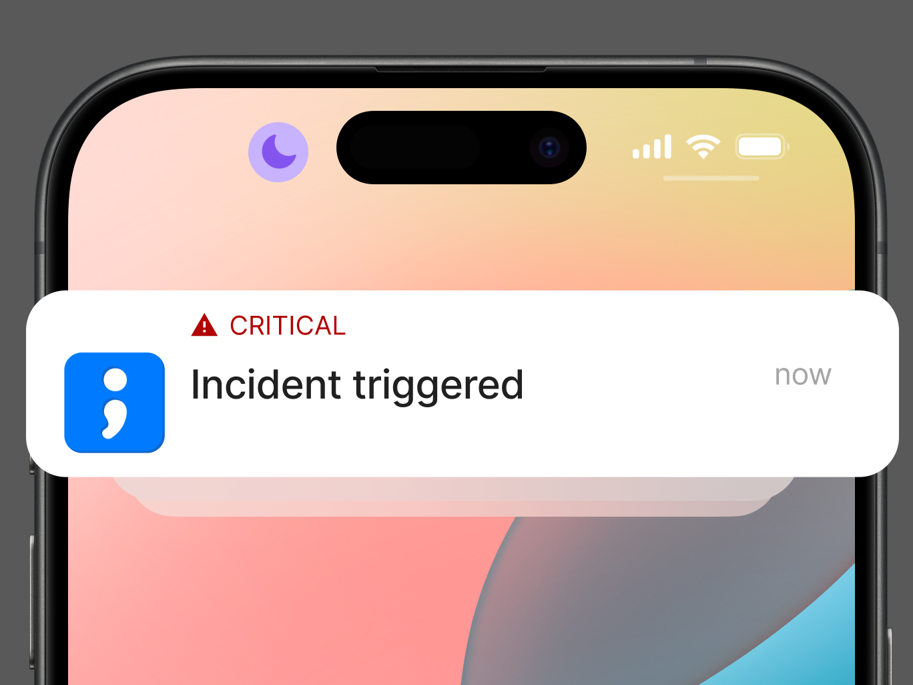

# Mobile app alerts

<figure><figcaption></figcaption></figure>

Spike's mobile app offers a super convenient way to stay ahead of incidents, ensuring you’re always informed no matter where you are. With real-time notifications, you can quickly respond to critical issues, keeping your operations running smoothly.
After downloading the app, make sure to log in and allow notifications to take full advantage of the alerting features.



<figure><figcaption></figcaption></figure>
[Download the iOS app](https://apps.apple.com/au/app/spike-sh/id1586777789) from the AppStore



<figure><figcaption></figcaption></figure>
[Download the Android app](https://play.google.com/store/apps/details?id=sh.spike.spike_sh_app ) from the PlayStore



## Setup
To receive notifications on your mobile device, make sure to set up phone notifications within your escalation policies. This will trigger mobile app alerts delivered directly to your phone, enabling you to respond promptly to incidents.

## Critical alerts
For iOS users, Spike's mobile app offers the option to receive Critical notifications (partnered with Apple) for critical incidents or for all incidents. This feature ensures that you never miss an important notification, even if your device is on Do Not Disturb mode. You can find this setting within the app under notification preferences.


Critical notifications make sound even when your iPhone is muted

