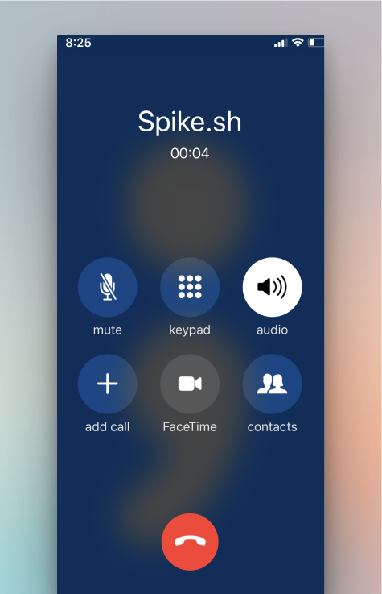

# Phone alerts

When an incident triggers, Spike calls your phone. During the call, press a key to take action:

1. Press **4** to acknowledge
2. Press **6** to resolve
3. Press **9** to escalate

<figure><figcaption>
Phone alerts from Spike.
</figcaption></figure>

Check if your country or region supports phone calls on the [geo permissions page](https://app.spike.sh/geo-permissions).


Make sure to verify your phone number before setting up phone alerts. You can update it in your [profile settings](https://app.spike.sh/settings/profile).

