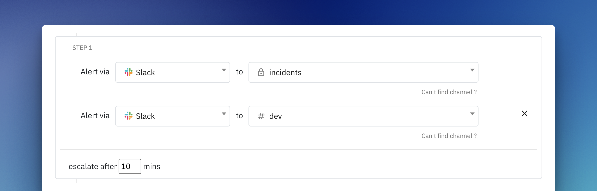
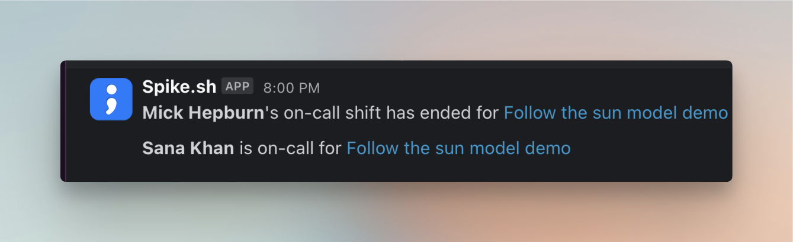
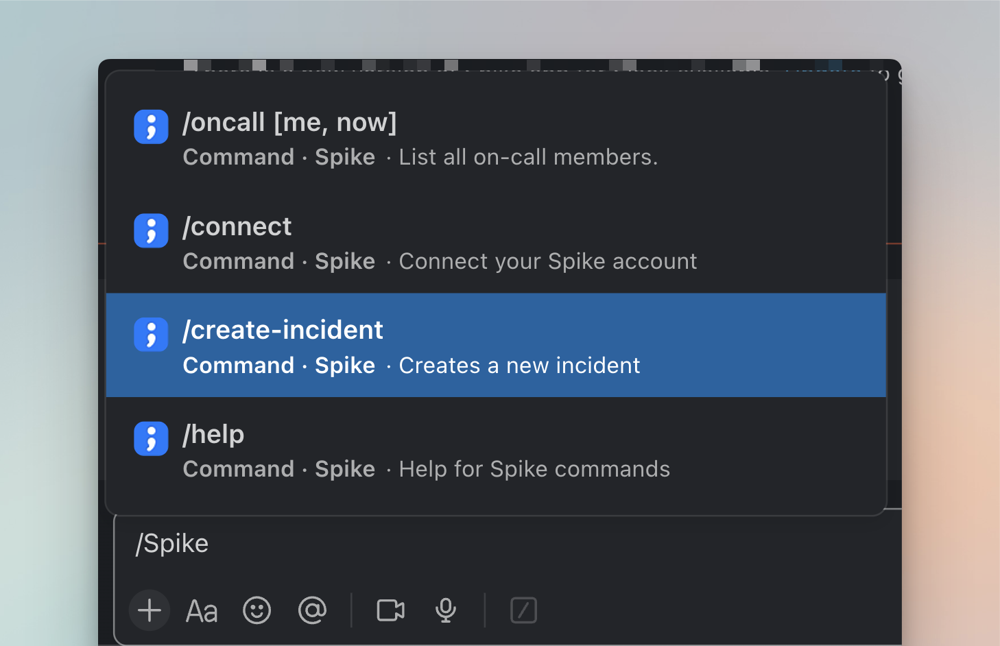
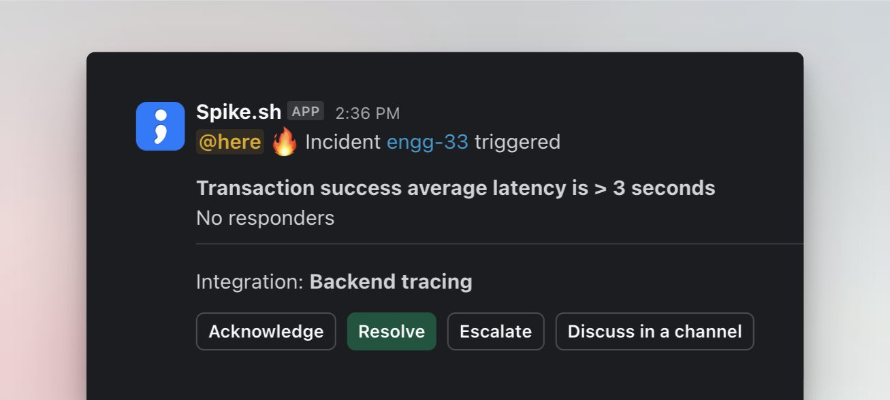
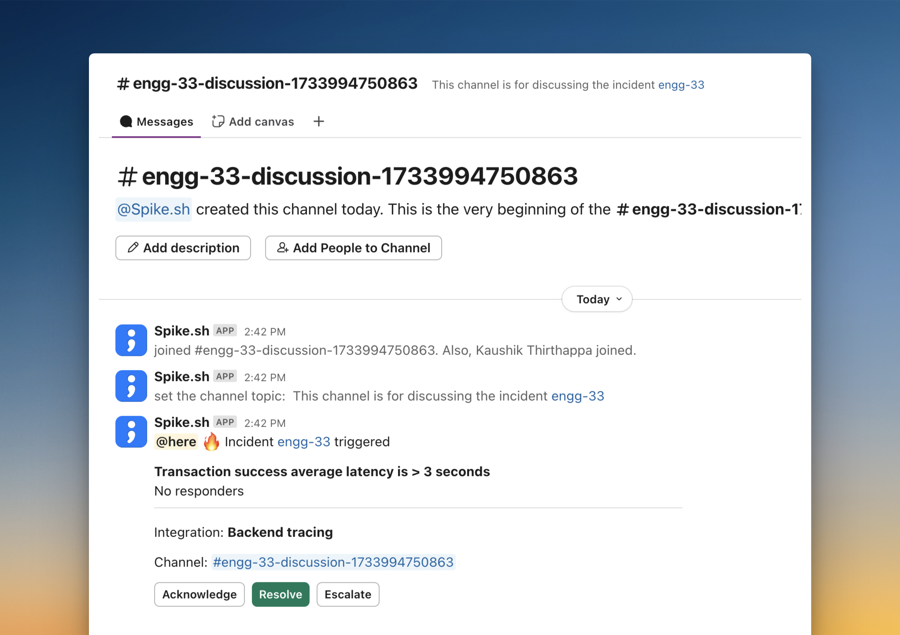
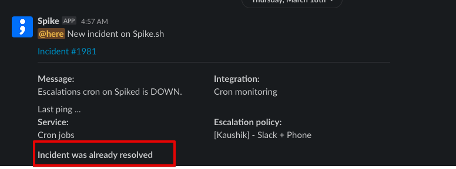
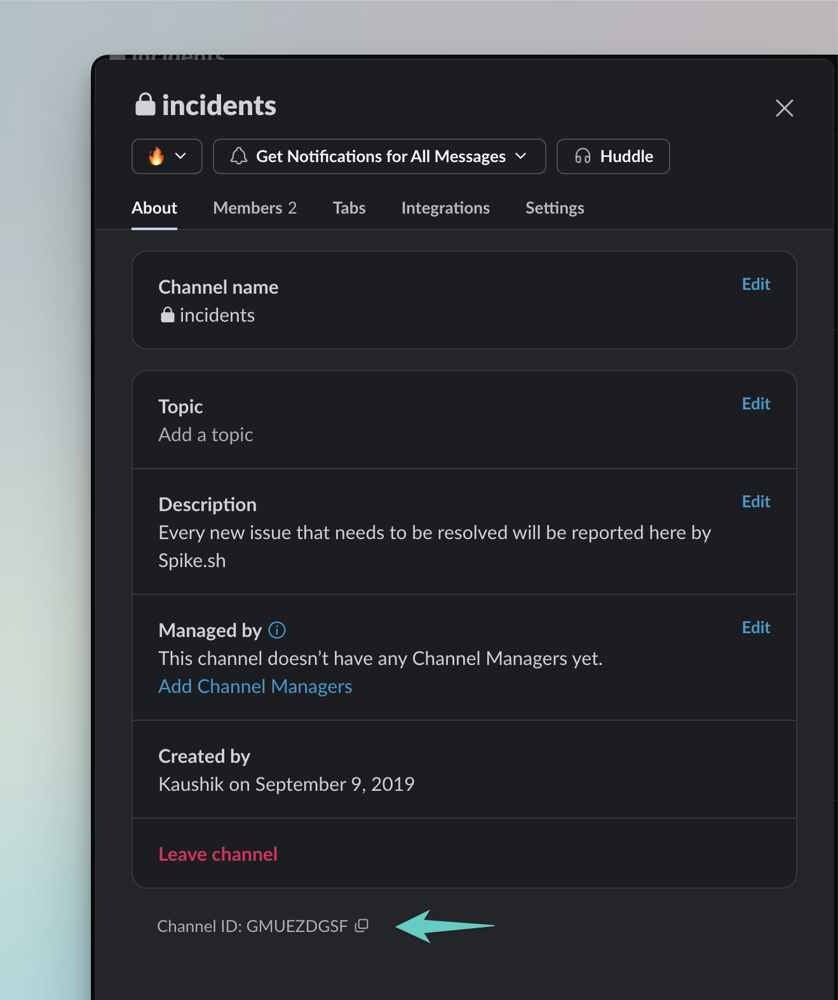

# Slack alerts

<figure><figcaption>
Spike app for Slack.
</figcaption></figure>

The Spike app for Slack keeps your team informed and responsive during incidents.

Key features:

- Incident alerts with acknowledge, resolve, and escalate actions
- On-call shift notifications
- Private channel support
- Create incidents directly from Slack
- View current on-call responders



* [Install Spike app on Slack](https://app.spike.sh/settings/general/alerts)
* [App on Slack marketplace](https://slack.com/apps/AKRF4KSG5-spike)
* [Set incident alerts with escalations](https://app.spike.sh/escalations)
* [Set on-call alerts](https://app.spike.sh/settings/general/alerts)



## How to set up

Visit the [Alerts section](https://app.spike.sh/settings/general/alerts) in settings and click **Add to Slack**.



<figure><figcaption>
Adding Slack to an escalation policy.
</figcaption></figure>

Visit the [Alerts section](https://app.spike.sh/settings/general/alerts) in settings and click **Add to Slack**. The Spike app requests some basic permissions.

Add Slack as a step in your [escalation policy](https://app.spike.sh/escalations) to receive incident alerts. You can choose between public or private channels.



<figure><figcaption>
On-call shift notifications on Slack.
</figcaption></figure>

Visit [Settings > Alerts](https://app.spike.sh/settings/general/alerts) to select Slack channels to receive on-call shift alerts.



* Other team members can link their Slack accounts to receive direct messages for important updates.
* Run the `/connect` command to connect.



Use the `/help` command in Slack for further help. The Spike app cannot read any of your messages.

## Slash commands

<figure><figcaption>
Slash commands available in the Spike app.
</figcaption></figure>

1. `/create-incident`: Create a new incident directly from Slack. Anyone in your workspace can use this.
2. `/oncall now` or `/oncall me`: Check who is currently on-call or view your on-call schedule.
3. `/connect`: Connect your Slack account with Spike.
4. `/help`: Display a help message with guidance on using the Spike app.

### Create incidents from Slack

Using `/create-incident` opens a form to create incidents directly from Slack.



### Add a title and details
Provide a clear title and relevant details, including JSON data or links if applicable.


### Select integration and escalation policy
Choose the integration and escalation policy to route the incident correctly.


### Submit
Click to create the incident.




Anyone in your Slack workspace can create incidents, even if they are not part of your Spike account.


## Incident alerts

<figure><figcaption>
Incident alert on Slack.
</figcaption></figure>

Spike's incident alerts mention `@here` to notify everyone online in the channel. Each alert includes the title, responders, links, and integration.

### Available actions

- **Acknowledge**
- **Resolve**
- **Escalate**
- **Discuss in a new channel**

### Discuss in a new channel

<figure><figcaption>
Discuss an incident in a dedicated Slack channel.
</figcaption></figure>

Each incident includes the option to discuss in a new channel. When triggered, a dedicated channel is created for the incident. Only the user who initiates the action is added initially. Spike cannot read messages in these channels.

### Auto-updating Slack messages

When an incident is resolved via phone, SMS, email, or the dashboard, the Slack message updates automatically to reflect the resolved status.

<figure><figcaption>
The Spike app notifies you if the incident was already resolved elsewhere.
</figcaption></figure>

If you try to resolve an incident on Slack that has already been resolved elsewhere, the app notifies you.

## Private channels

Private channel access can be configured in [Settings > Alerts](https://app.spike.sh/settings/general/alerts).

### Adding private channels to escalations

Only users who have connected their Slack account with Spike can view private channels in escalations. They can only see channels where:

1. They are a member.
2. The `@Spike.sh` app has been added.


Add the `@Spike.sh` app to your private channels to continue receiving alerts. This is mandatory for escalations configured before 11th December 2024.


### Private channel visibility

Once a private channel is added to an escalation, its name is visible only to users who:

1. Have connected their Slack account with Spike.
2. Are members of the same private channel.

## On-call alerts

<figure><figcaption>
On-call shift alerts on Slack.
</figcaption></figure>

Visit [Settings > Alerts](https://app.spike.sh/settings/general/alerts) to select Slack channels to receive on-call shift alerts. You can enable notifications for both shift start and shift end.

## FAQs

### Can anyone create an incident from Slack? Is there an extra charge?

No. Anyone in your workspace can create an incident and there is no additional cost.

### I can't find a channel in the dropdown. What should I do?

Paste the channel ID from Slack. To find it, open the channel, go to the **About** section, and copy the unique ID.

<figure><figcaption>
Find the channel ID in the About section.
</figcaption></figure>

### Why can't I see a private channel in the escalation dropdown?

You must be a member of the private channel, have connected your Slack account with Spike, and the `@Spike.sh` app must be added to that channel. Run `/connect` on Slack to connect your account.

### How do I add the @Spike.sh app to a private channel?

Type `/invite @Spike.sh` in the channel.

### Can all team members view private channels added to escalations?

No. Only users who are members of the private channel and have connected their Slack account with Spike can see it in escalations.

### Can the same discussion channel be reused for multiple incidents?

No. A new channel is created for each incident to keep discussions separate.

### What happens to a discussion channel after the incident is resolved?

The channel stays in your workspace until manually archived. Archive it after the incident is resolved to keep your workspace tidy.

### Can non-Spike users join a discussion channel?

Yes. Anyone in your workspace can be invited to join, regardless of their Spike account status.

### What happens if I disconnect my Slack account after adding private channels to escalations?

You will no longer see the private channel names in escalations, even if you are still a member of those channels.

### User A and B are in a private channel in the escalation policy, but B can't see the channel name. Why?

User B hasn't connected their Slack account with Spike. They can run `/connect` in Slack or send a direct message to the Spike bot to connect.
