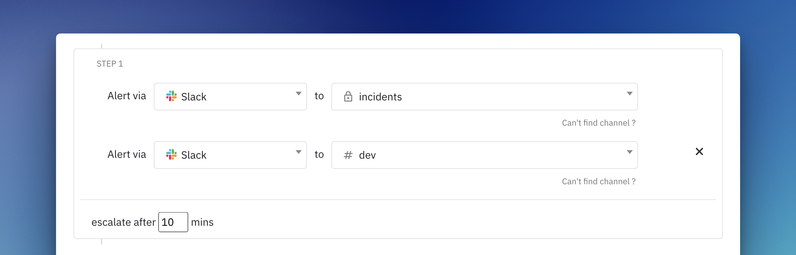

# Introduction
The Spike app for Slack keeps your team informed and responsive during incidents.

Key features include:
-	Incident alerts and acknowledge / resolve / escalate them
-	On-Call shift notifications
-	Private channel support
-	Create incidents directly from Slack
-	View currently on-call responders



* [Install Spike app on Slack](https://app.spike.sh/settings/general/alerts)
* [App on Slack marketplace](https://slack.com/apps/AKRF4KSG5-spike)
* [Set incident alerts with escalations](https://app.spike.sh/escalations)
* [Set on-call alerts](https://app.spike.sh/settings/general/alerts)



# How to set up
Visit the [Alerts section](https://app.spike.sh/settings/general/alerts) in settings and click on **Add to Slack.**



<figure><figcaption></figcaption></figure>

Visit the [Alerts section](https://app.spike.sh/settings/general/alerts) inside your settings and click on **Add to Slack.** Our Slack app asks for some basic permissions. 

Add Slack as a step in your [escalation policy](https://app.spike.sh/escalations) to get incident notifications. You can choose between public or private channels for these alerts.



<figure><figcaption></figcaption></figure>

Visit [Settings > Alerts](https://app.spike.sh/settings/general/alerts) to select Slack channels to receive on-call shift alerts.



* Other team members can also link their Slack accounts to receive direct messages for important updates.
* Run the `/connect` command to connect




Use the `/help` command on Slack for further help.


Spike's app cannot read any of your messages on Slack


---

# Slash commands

<figure><figcaption></figcaption></figure>

Here are all the available `/slash` commands - 

1. `/create-incident`
Create a new incident directly from Slack. Anyone in your workspace can use this command.

2. `/oncall now` or `/oncall me`
Check who is currently on-call or view your on-call schedule.

4. `/connect`
Connects your Slack account in the workspace with Spike.

4. `/help`
Display a help message with guidance on using the Spike app in Slack.

## Create incidents from Slack
Using the `/create-incident` command in Slack opens an intuitive view to create incidents directly from your workspace. Here's how:



### Add a Title and Details
Provide a clear and meaningful title along with relevant details, including JSON data or links if applicable.



### Select Integration and Escalation Policy
Choose the appropriate integration and escalation policy to ensure the incident is routed correctly.



### Submit
Click to create the incident. It's that simple!



1. __Add a Title and Details__: 
1. __Select Integration and Escalation Policy__: 
1. __Submit__: Click to create the incident. It's that simple!

This process is straightforward and accessible to anyone in your Slack workspace.

---

# Incident Alerts
<figure><figcaption></figcaption></figure>

Spike's incident alerts will mention `@here` to notify everyone online on the channel. The incident contains some key details like Title, Responders, Links, and Integration.

Available Actions for Each Incident
1. __Acknowledge__
2. __Resolve__
3. __Escalate__
4. __Discuss in a New Channel__

## Discussing in a new channel
<figure><figcaption></figcaption></figure>

Each incident includes the option to discuss in a new channel. When this action is initiated, a dedicated channel is created for collaboration on resolving the incident. Initially, only the user who initiates the action will be added to the new channel.

Spike does not have access to read messages in these channels, maintaining your privacy.

Who can create these channels?
 
Anyone in your workspace can initiate this action and create new channels.

Can the same channel be reused for multiple incidents?
 
No, a new channel is created for each incident to keep discussions organized and focused.

What happens to the channel after the incident is resolved?
 
The channel remains in your workspace until it is manually archived. We recommend archiving the channel after resolving the incident to keep your workspace tidy.

Can non-Spike users participate in the channel?
 
Yes, anyone in your workspace can be invited to join the discussion, regardless of their Spike account status.


We recommend archiving the channel once the incident is resolved to prevent stale channels in your workspace.


## Auto-Updating Slack messages

If a Slack alert has been sent for a new incident and it is resolved—whether automatically, via Phone, SMS, Email, or the Dashboard—the Slack message will automatically update to reflect the resolved status, eliminating any ambiguity about the incident’s state.

Will the Slack message update if an incident is resolved automatically?

Yes, the Slack message will automatically update to show the resolved status.

What if I try to resolve an incident on Slack that has already been resolved elsewhere?

<figure><figcaption></figcaption></figure>
The Slack app will notify you that the incident has already been resolved, preventing duplicate actions.

---

## Private channels setup
Private channels access can be configured in [Settings > Alerts](https://app.spike.sh/settings/general/alerts)

### Adding private channels to escalations

When managing escalations, only users who have connected their Slack account with Spike can view private channels. However, they can only access private channels that:

1.	They are a member of.
2.	The `@Spike.sh` app has been added to.

Both the user and the `@Spike.sh` app must be part of the private channel for it to appear under escalations.

### Private channel visibility in escalations

Once a private channel is added to an escalation, its name is visible only to users who:

1.	Have connected their Slack account with Spike.
2.	Are members of the same private channel.

Users without these permissions will not see the private channel name, ensuring enhanced privacy.

Why can’t I see a private channel in the escalation dropdown?
 
You must be a member of the private channel and have connected your Slack account with Spike. Additionally, the `@Spike.sh` app must be added to the private channel.

To connect, run the `/connect` command on Slack

Can all team members view the private channels added to escalations?
 
No, only users who are members of the private channel and have connected their Slack account with Spike can view its name in escalations.

How do I add the @Spike.sh app to a private channel?
 
Invite by typing `/invite @Spike.sh` in the channel.

Can I add a private channel to escalations without connecting my Slack account?
 
No, your Slack account must be connected to Spike to add or view private channels in escalations.

What happens if I disconnect my Slack account after adding private channels to escalations?
 
You will no longer be able to view the private channel names in escalations, even if you are a member of those channels.

Can I see private channels added by other users in the escalation policy?
 
Only if you are a member of the same private channel and have your Slack account connected to Spike.

What if I’m an admin on Slack but not a member of the private channel?
 
Admin privileges on Slack do not grant visibility to private channels unless you are explicitly added as a member of the channel.

---
# On-call alerts

<figure><figcaption></figcaption></figure>

Visit [Settings > Alerts](https://app.spike.sh/settings/general/alerts) to select Slack channels to receive on-call shift alerts.

You can enable notifications for both shift start and shift end.

---

## FAQs

 

Can anyone create an incident? Is there an extra charge?

No, anyone can create an incident, and there is no additional cost.

 

User A and B are part of a private channel in the escalation policy, but B can’t see the channel name in Escalation. Why?

This happens when User B hasn’t connected their Slack account with Spike. To connect, they can:
- Search for the Spike.sh bot in Slack and send a direct message to connect.
- Run the `/connect` command to connect

I can’t find a channel in the dropdown. What should I do?

Click on the channel name to open the channel’s details. Within the channel details on the "About" section you can find the unique ID
<figure><figcaption></figcaption></figure>

