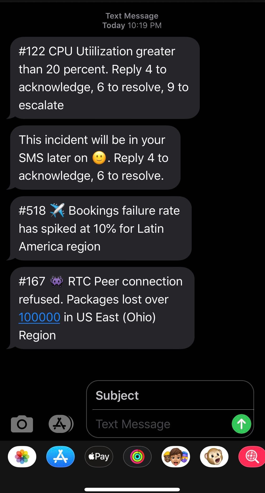

# SMS alerts

Spike sends an SMS when an incident triggers.

<figure><figcaption>
SMS alerts from Spike.
</figcaption></figure>

## Change incident status via SMS

You can acknowledge or resolve an incident by sending an SMS from your registered phone number. Send a new message (not a reply) with the incident ID:

1. **#\<incident\_id> ack** to acknowledge (example: `#1226 ack`)
2. **#\<incident\_id> res** to resolve (example: `#2071 res`)

Check if your country or region supports SMS on the [geo permissions page](https://app.spike.sh/geo-permissions).
