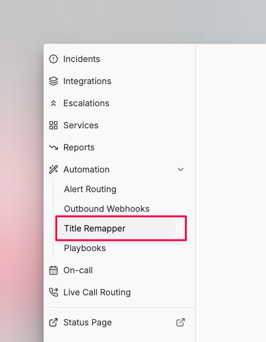
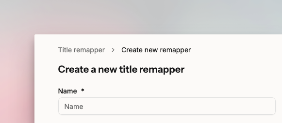
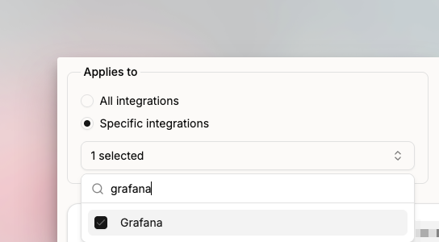

# Title Remapper

Title Remapper programmatically rewrites incident titles using HandlebarsJS templates and the payload your integration sends. Use it to add context like a project name or environment, so responders immediately understand what's happening.

**Without Title Remapper**

```
var temp is not defined
```

**With Title Remapper**

```
var temp is not defined for Notification service
```

## How to set up



### Create a new remapper

Go to **Automation** > **Title Remapper** and create a new remapper.

<figure><figcaption><p>Title Remapper is under Automation in the sidebar.</p></figcaption></figure>


### Name your remapper

Provide a name for the remapper.

<figure><figcaption><p>Name your remapper.</p></figcaption></figure>


### Select an integration

Choose the integration whose payload you want to parse.

<figure><figcaption><p>Select an integration to see its payload.</p></figcaption></figure>

Spike displays the integration's JSON payload in the preview section. Write your HandlebarsJS parser in the code editor on the left. Press **Try Now** to test the output, then hit **Save**.


Avoid `#each`, `#unless`, and any other loop constructs in your parser.




## Caveats

1. One Title Remapper can be linked to multiple integrations.
2. Link a remapper only to integrations it was built for. Linking a remapper built for AWS to a non-AWS integration can cause errors and missing titles.
3. If multiple Title Remappers are linked to the same integration, only the last linked remapper applies.

## Examples

All below examples use this payload:

```json
data: {
  "body": {
    "event_definition_id": "this-is-a-test-notification",
    "event_definition_type": "test-dummy-v1",
    "event_definition_title": "Event Definition Test Title",
    "event_definition_description": "Event Definition Test Description",
    "job_definition_id": "163",
    "job_trigger_id": "8999",
    "event": {
      "id": "NotificationTestId",
      "event_definition_type": "notification-test-v1",
      "event_definition_id": "EventDefinitionTestId",
      "origin_context": "urn:graylog:message:es:testIndex_42:b5etest--id-4-90ed-0dbeefbaz",
      "timestamp": "2021-05-05T09:42:42.823Z",
      "timestamp_processing": "2021-05-05T09:42:42.823Z",
      "timerange_start": null,
      "timerange_end": null,
      "streams": [
        "802109582109518290"
      ],
      "source_streams": [],
      "message": "Notification test message triggered from user <richard>",
      "source": "12837126856181276589235717181276589235716",
      "key_tuple": [
        "testkey"
      ],
      "key": "testkey",
      "priority": 2,
      "alert": true,
      "fields": {
        "field1": "value1",
        "field2": "value2"
      }
    },
    "backlog": []
  },
  "message": "Notification test message triggered from user <richard>"
}
```

### Basic

**Just the message**

```
{{data.message}}
```

Output: `Notification test message triggered from user <richard>`

**Get event title**

```
{{data.body.event_definition_title}}
```

Output: `Event Definition Test Title`

**Get more details about the event**

```
[{{data.body.event_definition_type}}] has incident => {{data.body.event_definition_title}}
```

Output: `[test-dummy-v1] has incident => Event Definition Test Title`

### Advanced

Use built-in HandlebarsJS helpers or the additional helpers from Spike's [Swag fork](https://github.com/spikehq/swag).

**Conditional title**

```
{{#if data.body.event_definition_desc}}
  Title: {{data.body.event_definition_title}}
{{else if data.body.event.message}}
  Message: [{{data.body.event.key}}] - {{data.body.event.message}}
{{else}}
  {{data.message}}
{{/if}}
```

Output: `Message: [testkey] - Notification test message triggered from user <richard>`

**Swag helpers**

```
{{uppercase data.message}} with priority {{add data.body.event.priority 1}}
```

Output: `NOTIFICATION TEST MESSAGE TRIGGERED FROM USER <RICHARD> with priority 3`

Visit the [Swag GitHub repo](https://github.com/spikehq/swag) for more examples.
