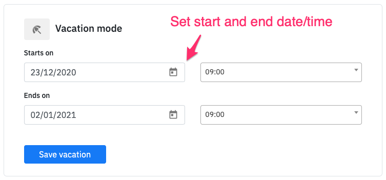

# Vacation mode

**Set vacation mode**

You can stop alerts to yourself for a period of time by setting up vacation mode. If you are on vacation mode, your alerts will be silenced. 

1. Go to your account settings in Spike.sh, and scroll down to the Vacation mode section.

2. Set the start and end date for the duration of your unavailability. You can then click **Save vacation** to set your vacation mode.

**Remove vacation mode**

1. To resume your alerts, you can remove the vacation mode from your account settings.

