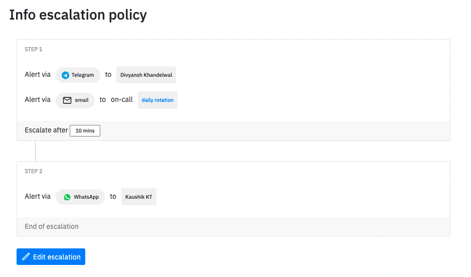

# WhatsApp

## WhatsApp alerts

In the changing times, SMS has gotten full of **spam**. Getting important alerts on SMS is becoming cumbersome as well. Yikes ! who wants that?!!

Our new WhatsApp bot takes away the pain of SMS and lets you take quick actions without ever leaving WhatsApp.

You can receive alerts for -

* New incidents
* Acknowledge timeout
* When your on-call shift starts
* When your on-call shift ends

You can add WhatsApp to your escalation policies and setup on-call notifications in [On-call settings](https://app.spike.sh/settings/personal-on-call)


To acknowledge or resolve, you reply to our WhatsApp bot with `ack test-123` and `res test-123`


### How to setup?

By default, WhatsApp is enabled for all phone numbers. You can directly add it in escalation policies and voila!

If WhatsApp isn't your preferred bot, may we recommend trying out our Telegram bot?!&#x20;


[telegram.md](telegram.md)

