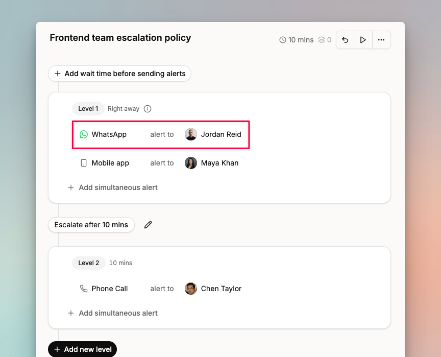

# WhatsApp

You can receive alerts for:

- New incidents
- Acknowledge timeout
- On-call shift start
- On-call shift end

<figure><figcaption>
WhatsApp alerts from Spike.
</figcaption></figure>

## How to set up

WhatsApp is enabled by default for all phone numbers. Add it to your escalation policies or configure on-call notifications in [On-call settings](https://app.spike.sh/settings/personal-on-call).

<figure><figcaption>
Adding WhatsApp to an escalation policy.
</figcaption></figure>


To acknowledge or resolve an incident, reply to the Spike WhatsApp bot with `ack test-123` or `res test-123`, where `test-123` is the incident ID.


If you prefer a different messaging bot, Spike also has a Telegram integration:


[telegram.md](telegram.md)

