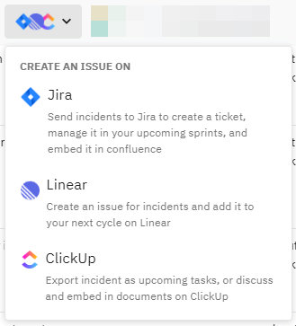
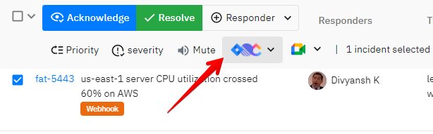

# Task management integrations

<figure><figcaption></figcaption></figure>

Some incidents need to be temporarily resolved as they could time-sensitive. There could be additional fixes and planning needed for a more long-term resolution. For increased collaboration and planning, we have built popular integrations with Task management providers.&#x20;

<figure><figcaption></figcaption></figure>

Here are the current integrations

1. JIRA Cloud ([https://www.atlassian.com/software/jira](https://www.atlassian.com/software/jira))
2. ClickUp ([https://clickup.com](https://clickup.com))
3. Linear ([https://linear.app](https://linear.app))

<figure><figcaption>
Select one or more incidents and hit the highlighted button to begin setting up
</figcaption></figure>

### Who can send incidents?

We believe Incident Management is a responsibility everyone should share. So, anyone from your team will have the access to send incident details and create tickets/tasks/issues on your project management platform

### Are these integrations bi-directional?

No.&#x20;

### Privacy

For most integrations, we don't get access to any info. If we do get any access then we don't read your project management platform's data including user info, task info, project info, etc. We only send incident data.


We do plan on extending support for more integrations. Please write to us at [support@spike.sh](mailto:support@spike.sh) to request one

