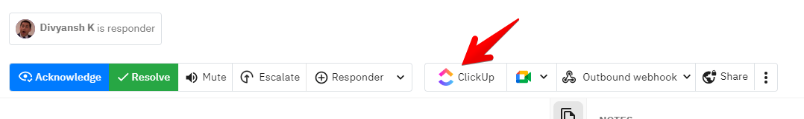

# ClickUp

### How to set up ClickUp?

To connect [ClickUp](https://clickup.com), Head up to Settings > Organization and find the Task management integrations section. The connect will take you to ClickUp to safely authenticate and grant us permission to create tasks on ClickUp.&#x20;

You can also alternatively set up from the Incidents table or from the incident details page

<figure><figcaption></figcaption></figure>


Once setup, every member across every team from your account will have access to create tickets on ClickUp from Spike.sh


### How to create a ticket on ClickUp from Spike.sh?

There are 2 ways.&#x20;

1. From the incidents table.&#x20;

<figure><figcaption>
Send incident data to ClickUp from Incidents table
</figcaption></figure>

&#x20; 2\. From the incident details page

<figure><figcaption>
Use the actions section on incident page to create ticket on Linear
</figcaption></figure>

