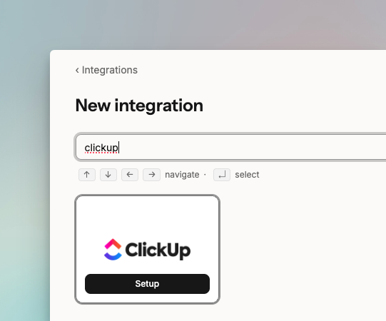
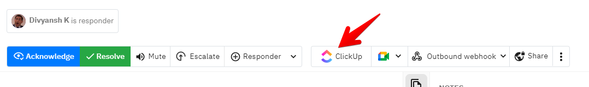

# ClickUp

## How to set up

Go to [Integrations](https://app.spike.sh/integrations) and find the **ClickUp** integration. Click **Connect** to authenticate with ClickUp and grant Spike permission to create tasks.

<figure><figcaption>
ClickUp setup in Integrations.
</figcaption></figure>


Once set up, every team member in your account can create ClickUp tasks from Spike.


## How to create a task

Open the incident details page and use the actions section to create a ClickUp task.

<figure><figcaption>
Use the actions section on the incident page to create a task on ClickUp.
</figcaption></figure>
