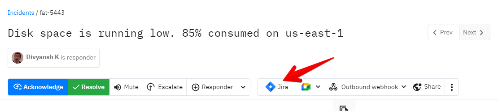

# JIRA Cloud

### How to set up JIRA Cloud?

Head up to Settings > Organization and find the Task management integrations section. The connect will take you to JIRA to safely authenticate and grant us permission to create tasks on JIRA.&#x20;

You can also alternatively set up from the Incidents table or from the incident details page

<figure><figcaption></figcaption></figure>


Once setup, every member across every team from your account will have access to create tickets on JIRA from Spike.sh


### How to create a ticket on JIRA from Spike.sh?

There are 2 ways.&#x20;

1. From the incidents table.&#x20;

<figure><figcaption>
Create a ticket from the incidents table
</figcaption></figure>

&#x20; 2\. From the incident details page

<figure><figcaption>
Use the actions section on incident page to create ticket on JIRA
</figcaption></figure>

You will need to fill in some details to create the ticket like the example below

<figure><figcaption>
Fill in the details to create ticket on JIRA from Spike.sh
</figcaption></figure>

