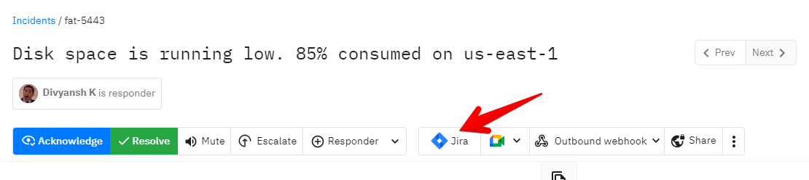

# JIRA Cloud

## How to set up

Go to [Settings > Organisation](https://app.spike.sh/settings/general/organisation) and find the **Task management integrations** section. Click **Connect** to authenticate with Jira and grant Spike permission to create tickets.

You can also set up the integration from the incidents table or the incident details page.

<figure><figcaption>
Jira Cloud setup in organisation settings.
</figcaption></figure>


Once set up, every team member in your account can create Jira tickets from Spike.


## How to create a ticket

There are two ways to create a Jira ticket from an incident:

1. From the incidents table

<figure><figcaption>
Create a ticket from the incidents table.
</figcaption></figure>

2. From the incident details page

<figure><figcaption>
Use the actions section on the incident page to create a ticket.
</figcaption></figure>

Fill in the required details and submit.

<figure><figcaption>
Fill in the details to create a ticket on Jira.
</figcaption></figure>
