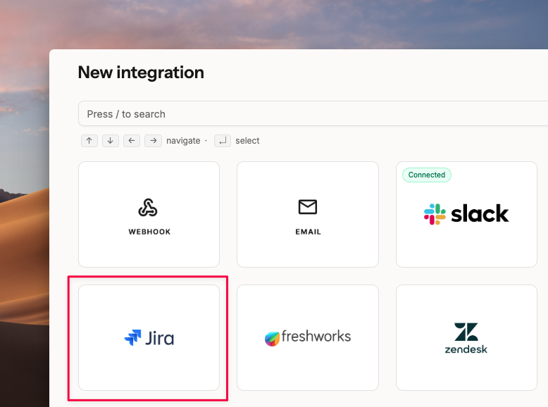
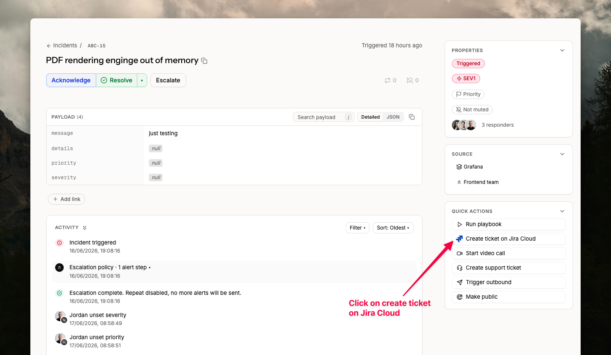
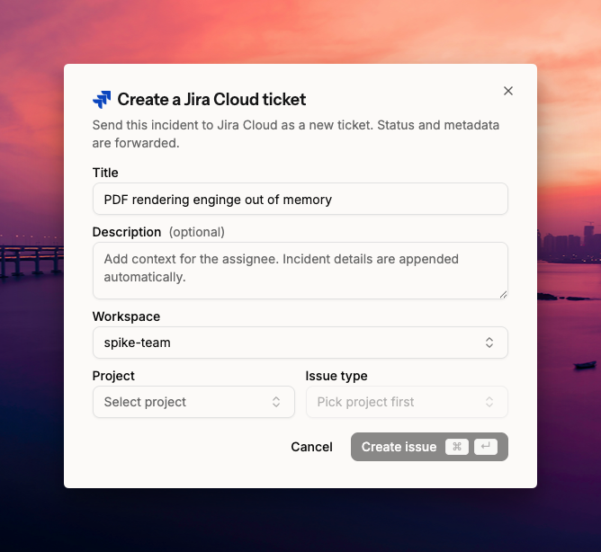

# JIRA Cloud

## How to set up

Go to [Integrations](https://app.spike.sh/integrations) and find the **Jira Cloud** integration. Click **Connect** to authenticate with Jira and grant Spike permission to create tickets.

<figure><figcaption>
Jira Cloud setup in Integrations.
</figcaption></figure>


Once set up, every team member in your account can create Jira tickets from Spike.


## How to create a ticket

Open the incident details page and use the actions section to create a Jira ticket.

<figure><figcaption>
Use the actions section on the incident page to create a ticket.
</figcaption></figure>

Fill in the required details and submit.

<figure><figcaption>
Fill in the details to create a ticket on Jira.
</figcaption></figure>
