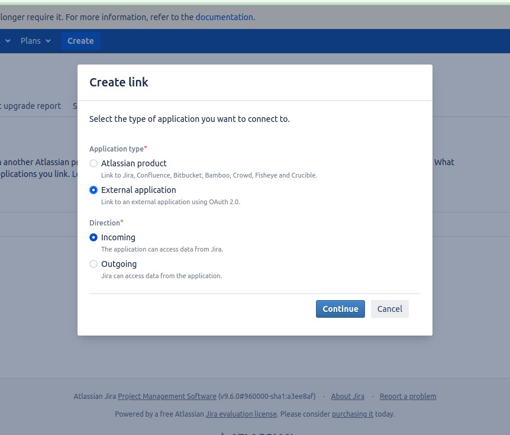
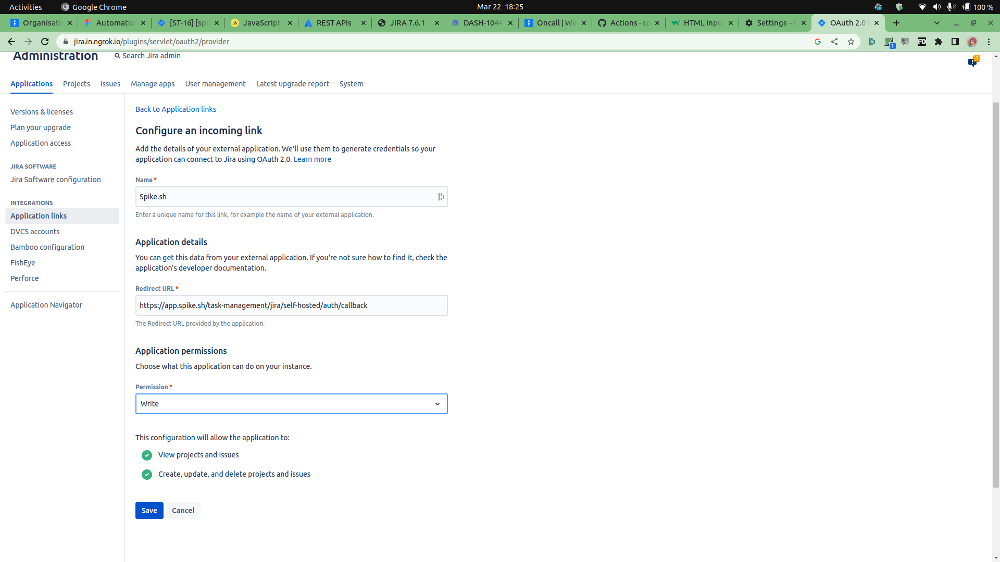
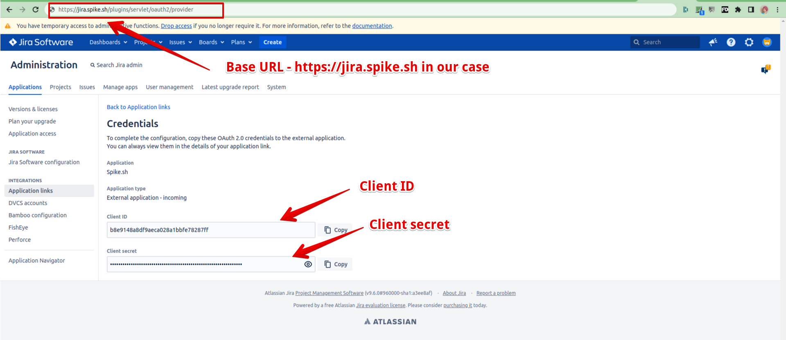

# JIRA server (self-hosted)

### How to setup JIRA server?

To setup, we need 3 things -

1. Base URL - the url where your server is currently hosted such as `jira.mydomain.com`
2. Client ID
3. Client Secret

We will need to generate Client ID and Client Secret. Let's get started

1. On your JIRA server, go to **settings -> applications**
2. Click on **Application Links**
3. and then click **Create Link**

<figure><figcaption></figcaption></figure>

4. On the modal for Create Link, select **External application** and I**ncoming**

<figure><figcaption></figcaption></figure>

5. On the next page, in the details, make sure to
   1. add a name i.e. **Spike.sh**
   2. this callback url -> `https://app.spike.sh/task-management/jira/self-hosted/auth/callback`
   3. Select **Write permission**
   4. **Hit save**

<figure><figcaption></figcaption></figure>

6. This will generate you Client Id and Client Secret. Copy these.
7. Your Base URL is the subdomain or domain where JIRA is hosted. In our case, it's `https://jira.spike.sh` with no trailing forward slashes.

<figure><figcaption></figcaption></figure>

So far, we have prepped our JIRA server to accept requests from Spike.sh. In the next step, let's configure Spike.sh.

### How to configure setup for final connection?

Visit the Task management section under [Settings > Organisation](https://app.spike.sh/settings/general/organisation#org--task-management) and select JIRA server. Enter the Base URL, Client ID, and Client Secret and hit Connect.

<figure><figcaption></figcaption></figure>

This will take you to your JIRA setup for validation. It's all done once permissions are granted on the next step.
