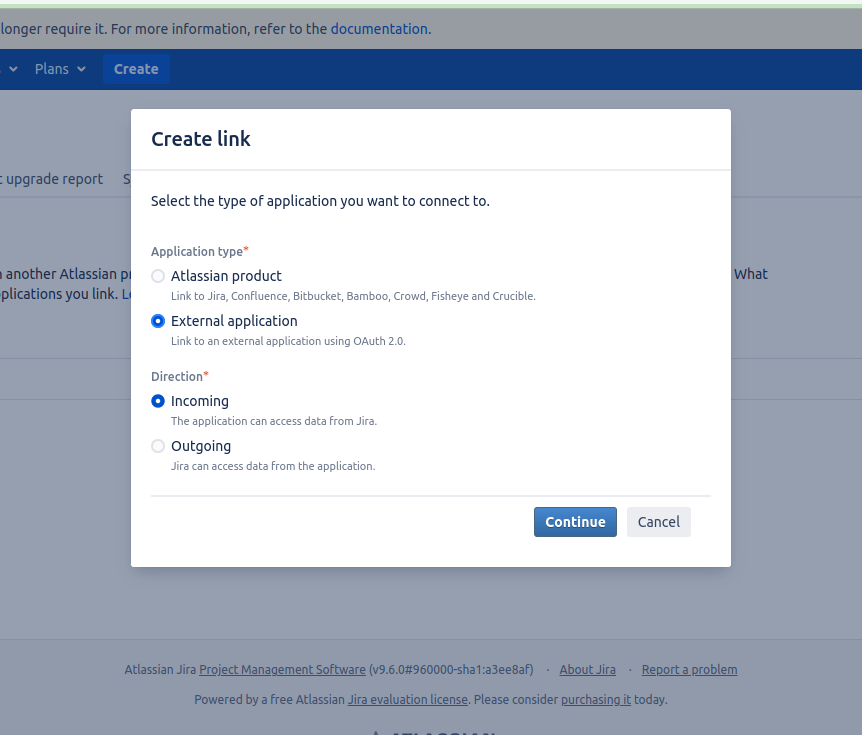
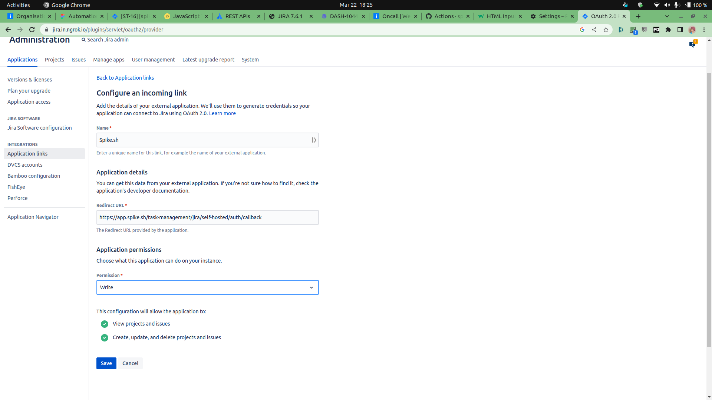
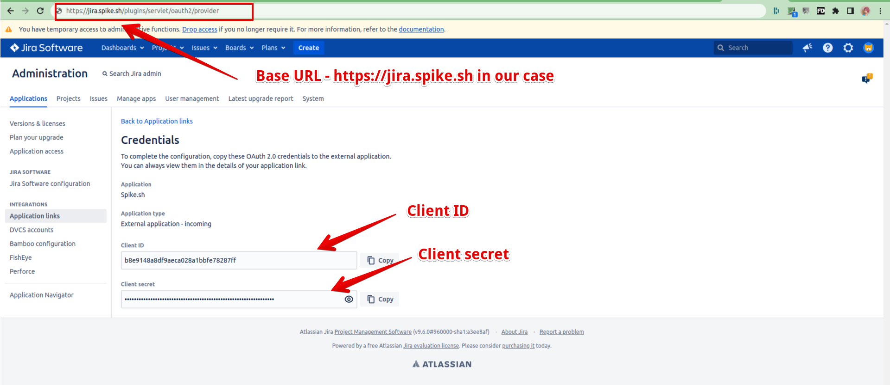

# JIRA server (self-hosted)

To connect, you need three things from your Jira server:

- **Base URL** (the domain where your server is hosted, e.g. `https://jira.mydomain.com`)
- **Client ID**
- **Client Secret**

## Generate credentials on Jira

1. On your Jira server, go to **Settings > Applications**
2. Click **Application Links**
3. Click **Create Link**

<figure><figcaption>
Application Links in Jira server settings.
</figcaption></figure>

4. On the Create Link modal, select **External application** and **Incoming**

<figure><figcaption>
Select External application and Incoming.
</figcaption></figure>

5. Fill in the details:
   - **Name**: Spike
   - **Callback URL**: `https://app.spike.sh/task-management/jira/self-hosted/auth/callback`
   - **Permission**: Write
   - Click **Save**

<figure><figcaption>
Fill in the application link details.
</figcaption></figure>

6. Copy the generated **Client ID** and **Client Secret**
7. Your **Base URL** is the domain where Jira is hosted, e.g. `https://jira.spike.sh`. Do not include a trailing slash.

<figure><figcaption>
Copy the Client ID and Client Secret.
</figcaption></figure>

## Connect in Spike

Go to [Settings > Organisation](https://app.spike.sh/settings/general/organisation#org--task-management) and select **JIRA server**. Enter the Base URL, Client ID, and Client Secret. Then click **Connect**.

<figure><figcaption>
Enter your Jira server credentials in Spike settings.
</figcaption></figure>

Jira opens for validation. Grant the requested permissions to complete the connection.
