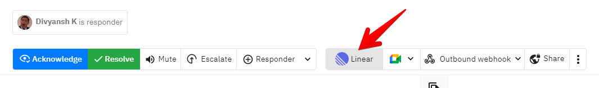
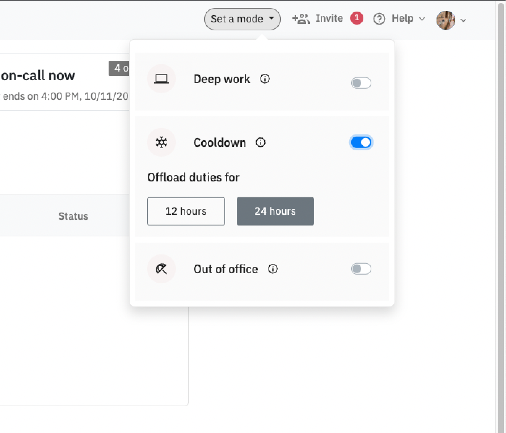

# Linear

### How to set up Linear?

To connect [Linear](https://linear.app), head to Settings > Organisation and find the Task management integrations section. The connect will take you to Linear to safely authenticate and grant us permission to create tasks on Linear.&#x20;

<figure><figcaption></figcaption></figure>

You can also alternatively set it up from the Incidents table or from the incident details page


Once setup, every member across every team from your account will have access to create tickets on Linear from Spike.sh


### How to create an issue on Linear from Spike.sh?

There are 2 ways

1. From the Incidents table

<figure><figcaption>
Create an issue on Linear from Incidents table
</figcaption></figure>

2\. From the incident detail page

<figure><figcaption>
Use the actions section on incident page to create ticket on Linear
</figcaption></figure>

Users will be asked to select a team to create an issue on Linear

<figure><figcaption></figcaption></figure>

