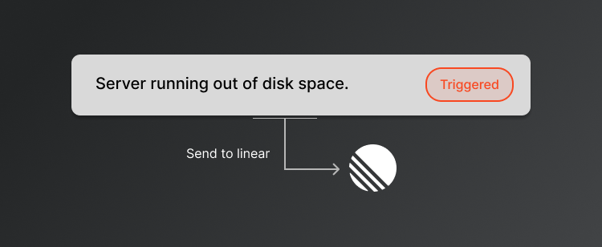
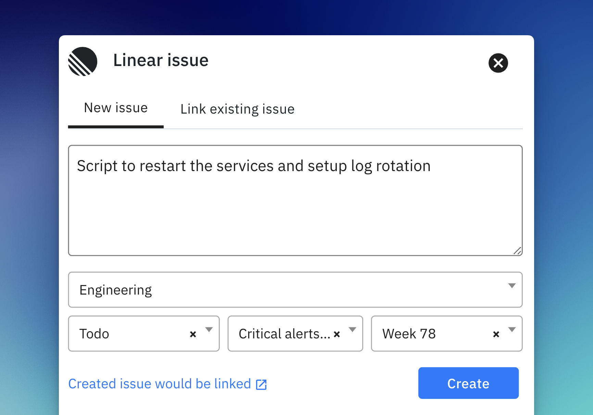
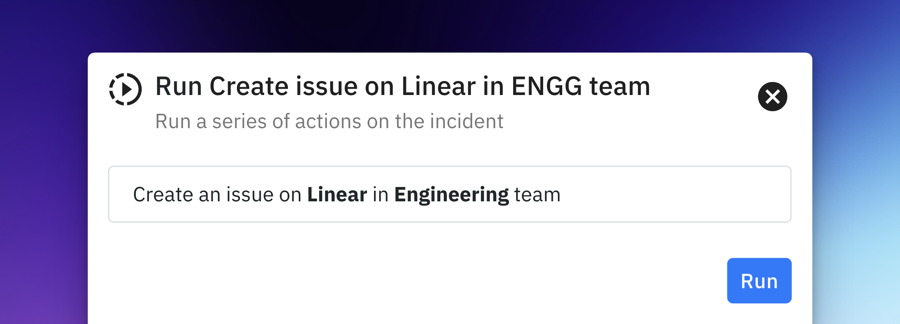
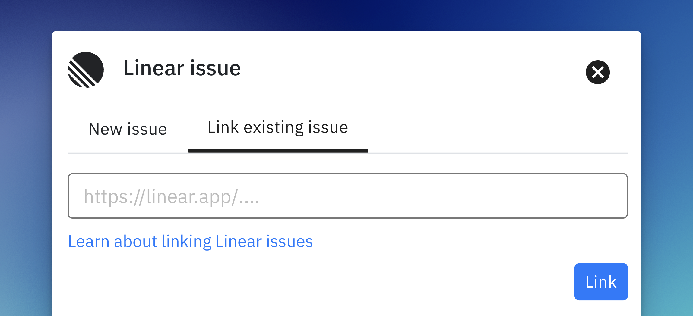

<figure><figcaption></figcaption></figure>

# Linear
The [Spike integration](https://linear.app/integrations/spike) for Linear automates the flow of incidents, status updates, and comments between both platforms, providing a centralized approach to managing incidents. It streamlines your incident response process, helping resolve incidents faster while keeping everyone in sync.

Main use cases -

1. Sync incident status with Linear issue status
2. Sync comments between both platforms
3. Create issues manually or automatically

## How it works
The Spike-Linear integration allows incidents to be sent directly from Spike to Linear, creating a seamless connection between your incident response system and task management. Once an incident is triggered in Spike, it automatically appears as an issue in Linear, where it can be tracked and addressed.

Status synchronization is key to this integration. When an issue is marked as "Done" in Linear, Spike automatically updates the corresponding incident to "Resolved." Likewise, when an issue is moved to "In Progress" in Linear, Spike pauses alerts by marking the incident as "Acknowledged." This bidirectional sync ensures smooth management of incidents across both platforms. Comments made on incidents in either platform are also synced, ensuring your team stays up-to-date.

Incidents from Spike can be sent to Linear manually or automatically using playbooks. All created issues will be automatically synced with Spike's incidents.


Changing an issue from "Done" back to "In Progress" on Linear will not change a resolved incident back to "Acknowledged" in Spike. Similarly, if an issue marked as "In Progress" on Linear is moved back to "Todo," it will not change an "Acknowledged" incident back to "Triggered" in Spike.

At Spike, status changes move in one direction:
**Triggered → Acknowledged → Resolved**


---

## Set up

To connect [Linear](https://linear.app), go to [Settings > Organisation](https://app.spike.sh/settings/general/organisation) and find the Task Management Integrations section. From there, you'll be guided to connect Linear to Spike. Once set up, all team members across your account can create tickets in Linear directly from Spike.sh.



  1. **Manually create issues**

  Select the incidents, locate the Linear button, and follow the prompts to create an issue.

  <figure><figcaption>
Create an issue on Linear
</figcaption></figure>

  2. **Automate creating issues**

  With [Playbooks](playbooks/introduction-to-playbooks), you can pre-configure and automate creating Linear issues. When creating a playbook, select Create an issue on, then Linear, and set up. 

  <figure><figcaption></figcaption></figure>


  You can link an existing issue from Linear with an incident on Spike to sync both statuses and comments. Multiple Linear issues can be linked to a single incident, and resolving the incident in Spike will automatically mark all associated issues in Linear as "Done."
  <figure><figcaption></figcaption></figure>



---

## FAQs

 

What permissions are needed to connect Linear with Spike?

You will need administrative access to connect Spike with Linear. Once connected, all team members in Spike will have access to create tickets in Linear from incidents in Spike.

 

What happens if an incident re-opens in Spike?

If an incident in Spike is re-opened after being resolved, the corresponding issue in Linear will remain unchanged unless manually updated.

 

What happens to comments on Spike if they are made on Linear?

When a comment is made on Linear, it appears in Spike as "Linear commented". Similarly, when someone comments on Spike, it appears in Linear as "Spike commented".

