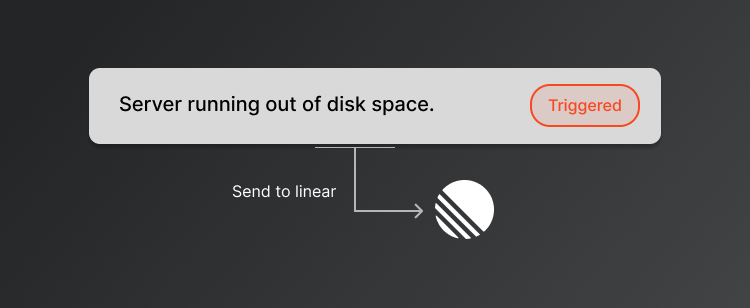
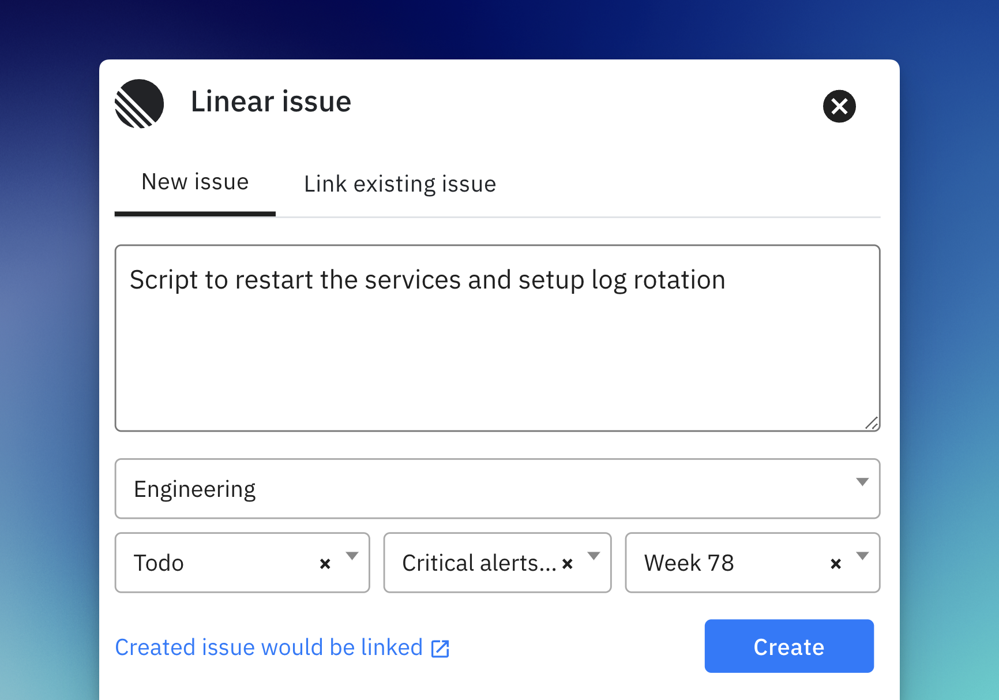
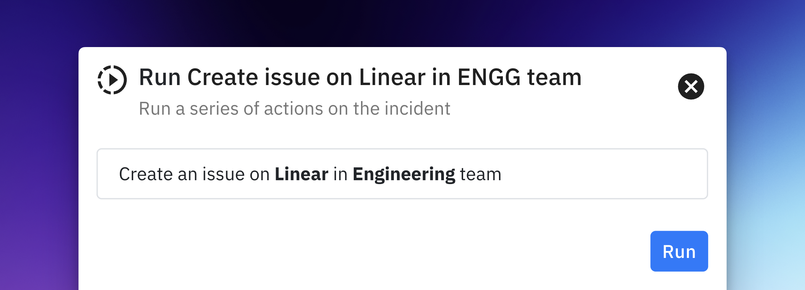
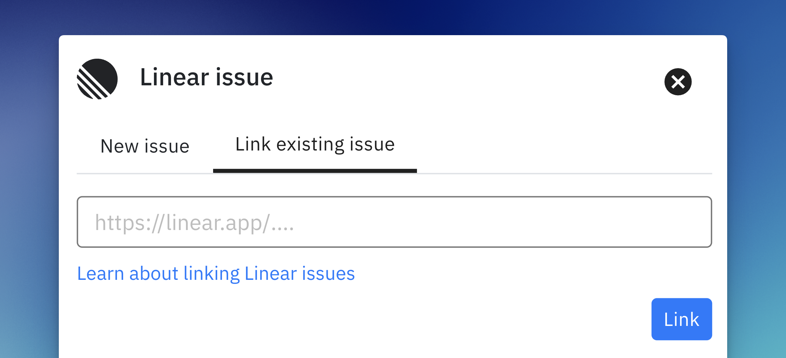

<figure><figcaption></figcaption></figure>

# Linear

Spike's Linear integration bridges incident response with task tracking. Create an issue from any incident and both platforms stay updated as it moves through resolution.

The integration supports three main capabilities:

- Sync incident status with Linear issue status
- Sync comments between both platforms
- Create issues manually or automatically

## How it works

When an incident triggers in Spike, it can appear as an issue in Linear. Your team can track and work on it in Linear while Spike stays updated.

Status changes sync in both directions. When an issue is marked "Done" in Linear, Spike resolves the corresponding incident. When an issue moves to "In Progress," Spike acknowledges it. Comments sync too. A comment on Linear appears in Spike as "Linear commented." A comment on Spike appears in Linear as "Spike commented."


Reverting an issue's status in Linear won't update the incident in Spike.

If an issue moves from "Done" back to "In Progress" on Linear, the resolved incident stays resolved. Resolved incidents are terminal in Spike and cannot be re-opened.

If an issue moves from "In Progress" back to "Todo" on Linear, the acknowledged incident stays acknowledged. In Spike, you can manually move an acknowledged incident back to triggered, but Linear's sync does not trigger that change.


## Set up

Go to [Settings > Organisation](https://app.spike.sh/settings/general/organisation) and find the **Task management integrations** section. Click **Connect** next to Linear and complete the authentication. Once set up, all team members in your account can create issues in Linear directly from Spike.



1. **Manually create issues**

Select the incidents, locate the Linear button, and follow the prompts to create an issue.

<figure><figcaption>
Create an issue on Linear.
</figcaption></figure>

2. **Automate creating issues**

With [Playbooks](../../playbooks/introduction-to-playbooks.md), you can pre-configure and automate creating Linear issues. When creating a playbook, select **Create an issue on**, then **Linear**, and complete the setup.

<figure><figcaption></figcaption></figure>


Link an existing Linear issue to a Spike incident to sync both statuses and comments. Multiple Linear issues can be linked to a single incident. Resolving the incident in Spike marks all associated Linear issues as "Done."

<figure><figcaption></figcaption></figure>



## FAQs

### What permissions are needed to connect Linear with Spike?

You need administrative access to connect Spike with Linear. Once connected, all team members in Spike can create issues in Linear from incidents.

### What happens to comments made on Linear?

A comment made on Linear appears in Spike as "Linear commented." A comment made on Spike appears in Linear as "Spike commented."
