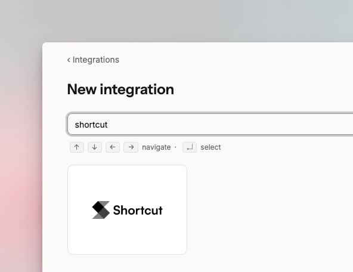
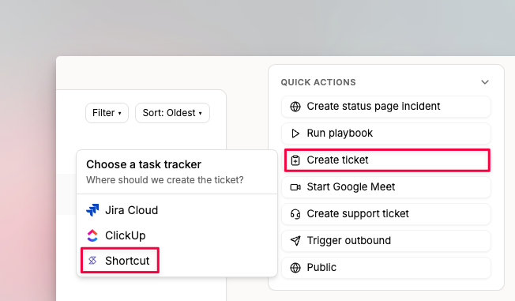
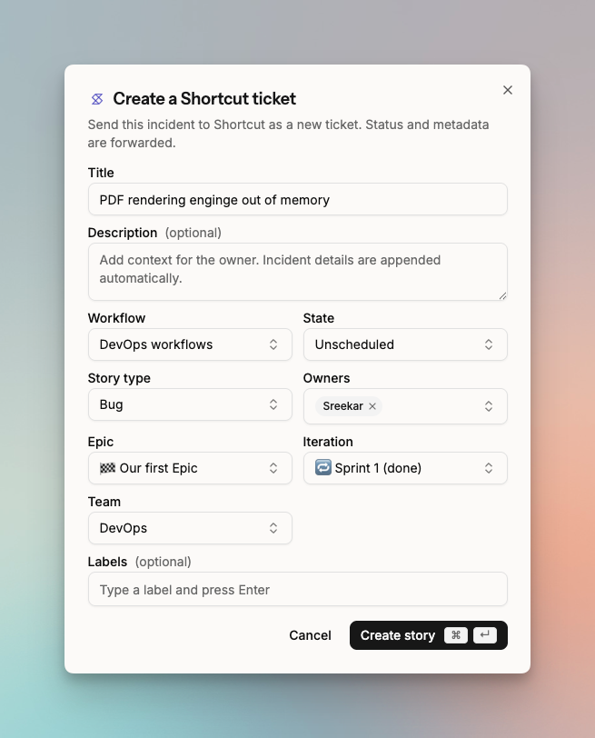
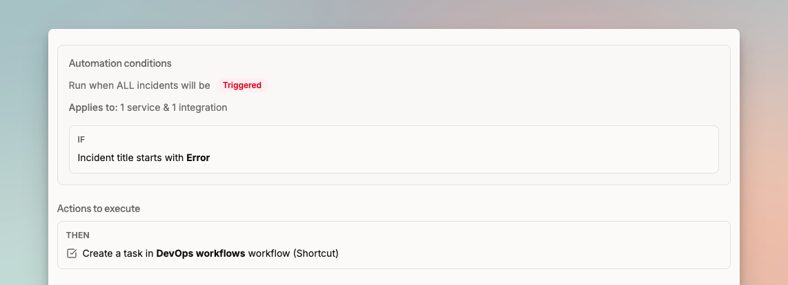
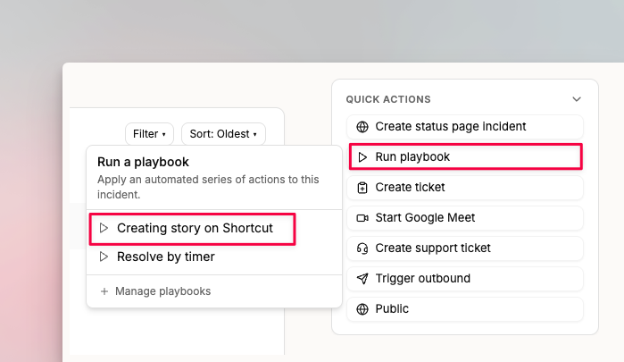

# Shortcut

Spike's Shortcut integration creates stories from incidents. Stories cover follow-up work like root cause analysis or longer-term fixes that go beyond immediate incident response.

## How to set up

Go to [Integrations](https://app.spike.sh/integrations) and find the **Shortcut** integration. Click **Connect** and enter your Shortcut API key. Spike validates the key and completes the connection.

<figure><figcaption>
Shortcut setup in Integrations.
</figcaption></figure>


Once set up, every team member in your account can create stories in Shortcut from Spike. Spike does not read any data from your Shortcut account.


## How to create a story

Open the incident details page and use the actions section to create a Shortcut story.

<figure><figcaption>
Create a story from the incident details page.
</figcaption></figure>

You can pre-configure story details before sending to Shortcut.

<figure><figcaption>
Pre-configure story details.
</figcaption></figure>

## Automate with Playbooks

Use [Playbooks](../../playbooks/introduction-to-playbooks.md) to automate creating Shortcut stories. For example, create a story automatically for every new incident with a specific title or on a specific service.

<figure><figcaption>
Automate Shortcut stories with Playbooks.
</figcaption></figure>

Team members with the right permissions can also run the Playbook manually.

<figure><figcaption></figcaption></figure>
