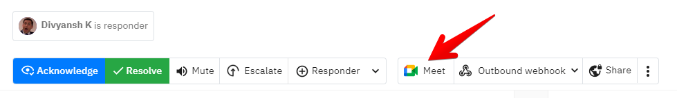

# War rooms

<figure><figcaption></figcaption></figure>

### What is a War room?

War room helps responders to stop worrying about which meeting link to join others during the  resolution for critical incidents ([Inspired from Situation Room](https://en.wikipedia.org/wiki/Situation\_Room\_\(photograph\))).&#x20;

Assume a critical incident triggers your systems and you, as a responder, need to gather other members immediately to try and quickly and mitigate the incident. At this time, the last thing anybody wants is confusion about where the call might be happening and struggling to find it.&#x20;


Every second matters during critical incident resolution. The last thing we want is for members to scramble around to find the right link to join the discussion. **War rooms solve this problem.**


Our war room integrations are --

1. Google Meet
2. Zoom (_coming soon_)
3. Your personal link (_think Daily.co, Gather.town, etc_)

### How to set up?

Visit your account [Settings > Profile and find War rooms](https://app.spike.sh/settings/personal-alerts#video-conferencing-block) or [click here ](https://app.spike.sh/settings#video-conferencing-block)and link Google Meet or add your personal room's link. For your personal room, just paste the link and it's done.

#### How we create meeting links?

Connect your Google account and grant us permission to access your calendar. When creating a meeting link, we will need to create a Calendar event on your account and generate a Meet link.&#x20;


We do not read your calendar events (_got nothing to gain from it_). We only create a calendar event and get the attached Google Meet link. Unfortunately, there is no direct Google Meet API to create new calls.


### How to create war rooms?

There are 2 ways.

1. **From the dashboard.** Select one or more incidents and hit the Google Meet icon to create a war room instantly.

<figure><figcaption>
From the dashboard
</figcaption></figure>

2\. **From the incident page.** Hit the Meet icon to instantly create a war room for this incident.

<figure><figcaption>
From the incident page
</figcaption></figure>

### How do other responders join you in the war room?

There are 2 ways to do this.&#x20;

1. Invite while creating the war room. Users will have the option to edit information

&#x20;   &#x20;

<figure><figcaption></figcaption></figure>

2\. **From the dashboard header.** Members from your team can instantly see ongoing war rooms from the dashboard header. This war room section will automatically appear for everyone and will have permissions to join the room as well.

<figure><figcaption>
Users can access current war rooms from the header
</figcaption></figure>

We are working on a zoom integration as well. Look out for our newsletter for updates.

