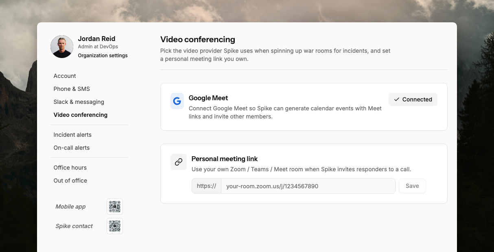
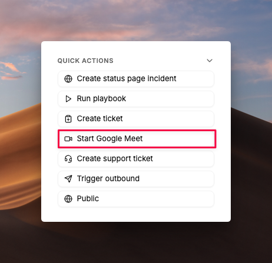
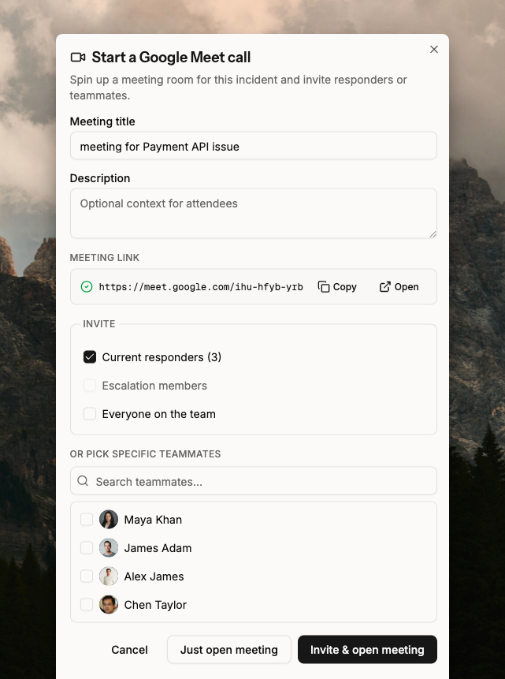

<figure><figcaption></figcaption></figure>

# War rooms

When an incident triggers and your team needs to coordinate on a call, war rooms create an instant meeting link tied to the incident. Everyone knows exactly where to join.

Spike supports:

1. Google Meet
2. Zoom _(coming soon)_
3. Your personal room link (Daily.co, Gather.town, or any URL)

## Set up

Go to **Organization Settings > Video Conferencing** and connect Google Meet or add a personal room link. For a personal room, paste the link and it's ready to use.

<figure><figcaption>
Video Conferencing in Organization Settings.
</figcaption></figure>

### How Google Meet links work

Spike connects to your Google account and requests permission to access Google Calendar. When a war room is created, Spike creates a calendar event on your account and generates a Meet link from it.


Spike does not read your calendar events or store them. It only creates a calendar event to generate the Meet link.


## Create a war room

Open the incident page and click **Start Google Meet** from the Quick Actions menu.

<figure><figcaption>
Start a war room from the incident page.
</figcaption></figure>

## Invite others to join

When creating the war room, you can invite current responders, escalation members, or the entire team. You can also search for specific teammates to add.

<figure><figcaption>
Invite members while creating the war room.
</figcaption></figure>


Spike's Google App is currently pending verification for extended access to calendar scopes.

