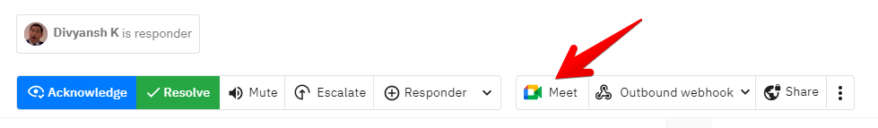

<figure><figcaption></figcaption></figure>

# War rooms

When an incident triggers and your team needs to coordinate on a call, war rooms create an instant meeting link tied to the incident. Everyone knows exactly where to join.

Spike supports:

1. Google Meet
2. Zoom _(coming soon)_
3. Your personal room link (Daily.co, Gather.town, or any URL)

## Set up

Go to [Settings > Profile > War rooms](https://app.spike.sh/settings/personal-alerts#video-conferencing-block) and connect Google Meet or add a personal room link. For a personal room, paste the link and it's ready to use.

### How Google Meet links work

Spike connects to your Google account and requests permission to access Google Calendar. When a war room is created, Spike creates a calendar event on your account and generates a Meet link from it.


Spike does not read your calendar events or store them. It only creates a calendar event to generate the Meet link.


## Create a war room

There are two ways to create a war room:

1. **From the incidents table.** Select one or more incidents and click the Google Meet icon.

<figure><figcaption>
Create a war room from the incidents table.
</figcaption></figure>

2. **From the incident page.** Click the Meet icon to create a war room for that incident.

<figure><figcaption>
Create a war room from the incident page.
</figcaption></figure>

## Invite others to join

There are two ways for other responders to join:

1. **Invite while creating.** Add members when creating the war room.

<figure><figcaption></figcaption></figure>

2. **From the dashboard header.** Active war rooms appear in the dashboard header automatically. All team members can see and join ongoing war rooms from there.

<figure><figcaption>
Access ongoing war rooms from the dashboard header.
</figcaption></figure>


Spike's Google App is currently pending verification for extended access to calendar scopes.

