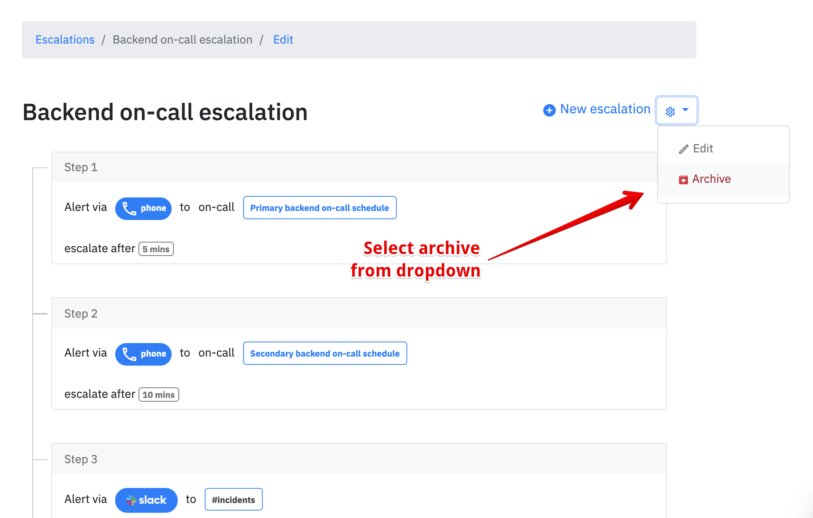
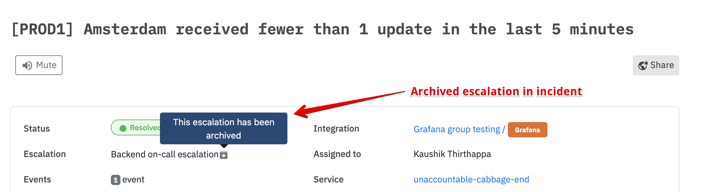

# Archive escalation policy

## How to archive an escalation policy?

You can choose to archive an escalation policy given that the policy is not associated with any existing integration. 

Visit your [escalations page](https://app.spike.sh/escalations) and select a policy. Click on the settings icon and select archive. 

### Restrictions on archiving 

If your escalation policy is already in use on other integrations then you won't be able to archive. Edit your integrations to associate with another escalation. 


Once the escalation is not in use with any integration, you would be allowed to archive.


### Does this affect on-call schedules?

No

### Does this affected existing incidents?

No. In fact, the existing incidents will prompt you about archived policy to avoid misinformation

### How to restore an archived policy?

There is no automated process. If you certain about restoring talk to us via chat from the dashboard or email us at [support@spike.sh](mailto:support@spike.sh)

