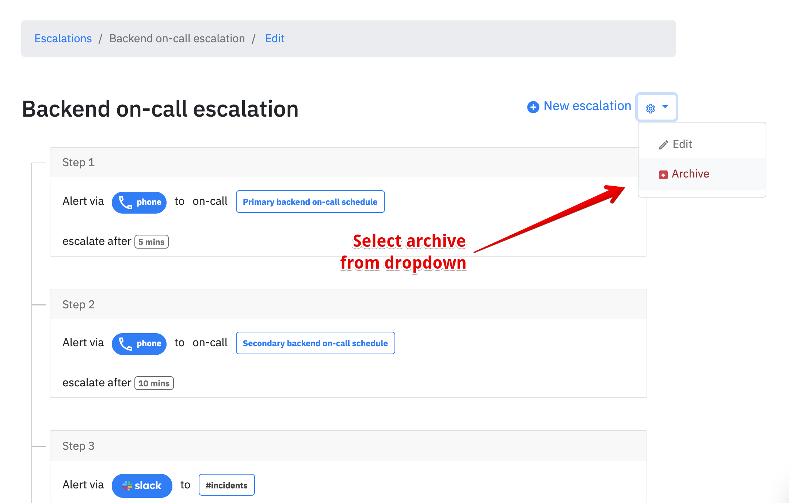
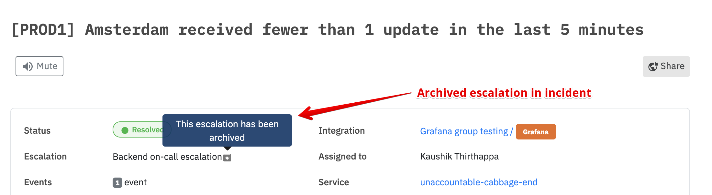

# Archive escalation policy

You can archive an escalation policy when it's no longer associated with any integration. Visit your [escalations page](https://app.spike.sh/escalations), select a policy, click the settings icon, and select **Archive**.

<figure><figcaption>
Select Archive under the policy settings.
</figcaption></figure>

## Restrictions

If the policy is in use on one or more integrations, archiving is not available. Update those integrations to use a different escalation policy first.


Once the policy is no longer associated with any integration, you can archive it.


## FAQs

### Does archiving affect on-call schedules?

No. Archiving an escalation policy does not affect on-call schedules.

### Does archiving affect existing incidents?

No. Existing incidents retain a reference to the archived policy. Spike displays a notice on those incidents to flag that the policy has been archived.

<figure><figcaption>
Spike flags archived policies on existing incidents.
</figcaption></figure>

### How do I restore an archived policy?

There's no self-serve restore option. Contact support via chat from the dashboard or email [support@spike.sh](mailto:support@spike.sh).
