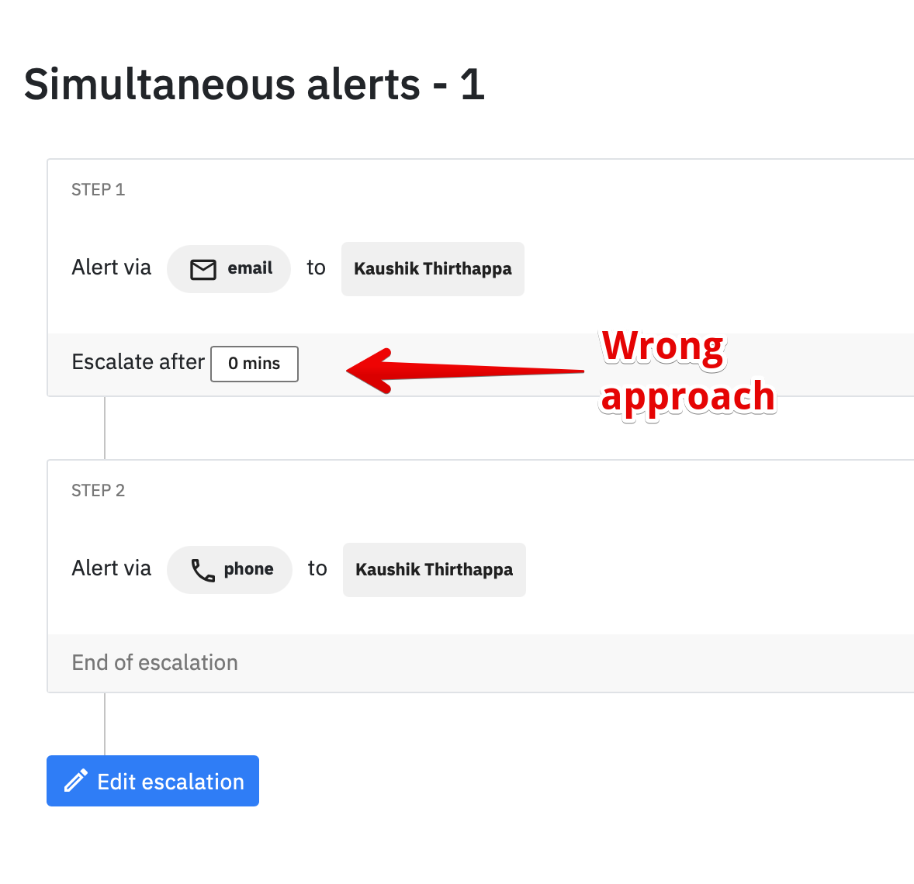
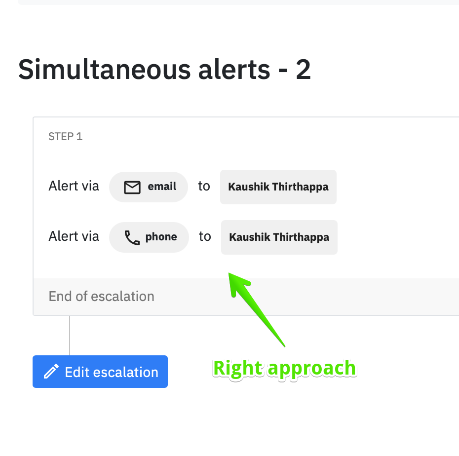

# How to create an escalation policy?

Head over the [escalations section](https://app.spike.sh/escalations) on the dashboard and click on new escalation

.png>)

1. Make sure to give a good identifiable name based on the team members in it.
2. Add multiple escalation levels
3. Add a **time to wait** before automatically escalating if incident is open (not acknowledged or resolved)
4. Save


Avoid adding any time interval for the last step where escalation ends. 


## Caveats

### Simultaneous alerts

If you would like to receive simultaneous alerts for either you, your team or Slack, Teams, etc then we highly recommend adding multiple alerts in one escalation step vs creating another step with 0 minutes as interval. 

