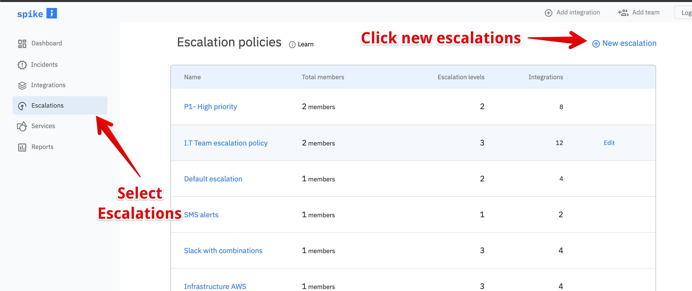
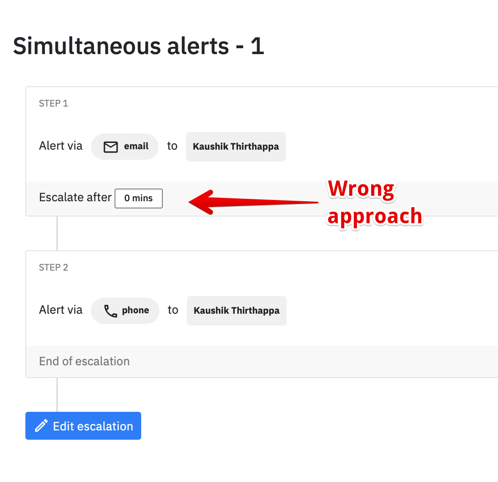
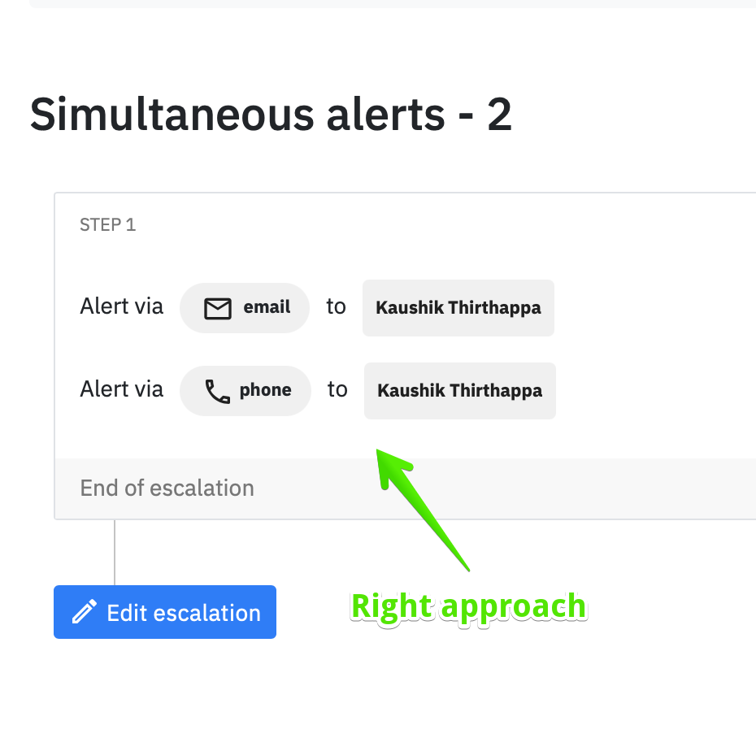

# How to create an escalation policy



### Go to Escalations

Navigate to the [Escalations section](https://app.spike.sh/escalations) on the dashboard and click **New escalation**.

<figure><figcaption>
Select Escalations from the sidebar.
</figcaption></figure>


### Configure the policy

1. Give the policy a clear, identifiable name.
2. Add one or more escalation levels.
3. Set a timeout for each level. This is how long Spike waits before escalating to the next level if the incident isn't acknowledged or resolved.

<figure><figcaption>
An example escalation policy with two levels.
</figcaption></figure>


Leave the time interval blank on the last escalation step.



### Save

Click **Save** to activate the policy.



## Simultaneous alerts

To alert multiple people or channels at the same time, add them as separate alerts within the same escalation level. Avoid creating a new escalation level with a 0-minute interval. This is not the same as simultaneous alerting.

<figure><figcaption>
Incorrect: a separate level with 0-minute interval.
</figcaption></figure>

<figure><figcaption>
Correct: multiple alerts within one escalation level.
</figcaption></figure>
