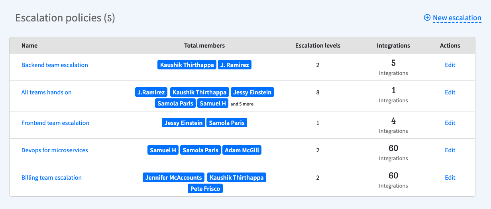

# Introduction to escalations

## What is an escalation policy?

An escalation policy is a simple set of rules to alert the right person at the right time using the right channel such as phone, slack or email. If that person misses out then the incident gets escalated to the next person.

## Basics

When an incident is triggered an escalation policy comes into affect to send alerts. Spike continues to send alerts according to the policy until someone acknowledges an incident.


You can create unlimited escalation policies with multiple levels of escalations


As per the above example, we have 2 levels of escalations. After the alert is sent via the first level, Spike will wait for only 5 minutes for someone to **acknowledge or resolve** the incident before automatically escalating to the next level. 

You can configure the timeout \(in this case, 5 minutes\) between escalation levels. You can create as many escalation levels as you want. **You can choose to alert multiple people via different \(or same\) alert channels simultaneously**. 


~~At the end of escalation, they are automatically repeated.~~ 

Escalations are no more repeated automatically. You will need to configure this in the integration settings. [Learn more](https://docs.spike.sh/escalations/repeat-escalations)


