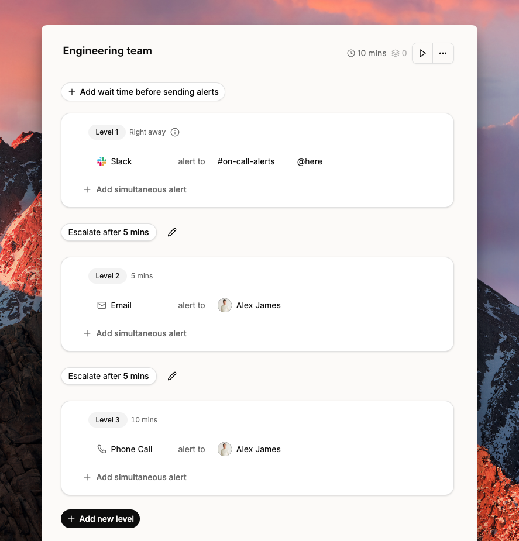
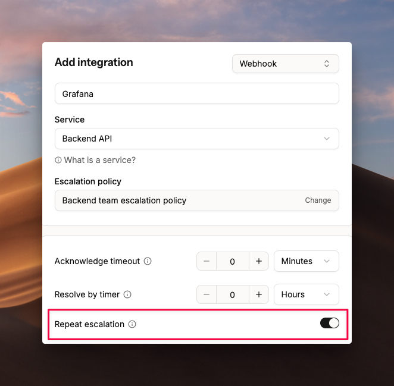

# Repeat escalations

When all escalation levels are exhausted and no one has taken action, repeat escalations restart the policy from the top. Spike repeats the cycle until someone acknowledges or resolves the incident, or the repeat limit is reached.

## How it works

Consider this escalation policy:

1. Alert on #on-call-alerts Slack channel
2. Email Alex James
3. Phone call to Alex James

<figure><figcaption>
An example escalation policy with three levels.
</figcaption></figure>

If no one on the Slack channel takes action and Alex doesn't respond, Spike restarts from Step 1 after a default interval of 10 minutes.


Escalations repeat a maximum of 5 times to prevent alert fatigue.


## How to set up

Repeat escalations are configured per integration, not globally. This gives you control over which integrations are critical enough to never miss. Configure it while adding or editing an integration. Select the **Repeat escalation** checkbox and save.

<figure><figcaption>
Enable repeat escalations on an integration.
</figcaption></figure>

## FAQs

### What stops repeat escalations?

Acknowledging or resolving the incident stops the repeat cycle. Alerts stop automatically once either action is taken.


[how-to-change-incident-status.md](../incidents/how-to-change-incident-status.md)


### How many times do escalations repeat?

By default, escalations repeat up to 5 times. After that, no further alerts are sent.
